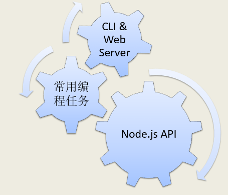

.png)

#### 为什么学习node.js？

- 前端开发人员进行学习node.js 可以实现前端和后端的开发，进行全栈开发
- 前端部署工具，前端自动化工具的使用
- node.js的npm管理器有全球最大的第三方库，供前端开发人员进行使用（引入第三方工具）

#### node.js学习安排

本课程会学到三种类型的应用程序开发：命令行程序、web 服务器网站、`Javascript` 库

本课程会选择 Linux 作为开发环境

```markdown
因为现在很多程序的开发环境和部署环境都是 Linux，这样会方便程序的测试和调试，而且可以创造一个学习和使用 Linux的场景。
```



#### 作业任务

##### 任务 1：浏览 Node.js 官网

- [Node.js 官方网站](https://nodejs.org/)
- [Node.js 中文网站](http://nodejs.cn/)

##### 任务 2：浏览 Node.js API

- [Node.js 官方 API](https://nodejs.org/dist/latest-v8.x/docs/api/)
- [Node.js 中文 API](http://nodejs.cn/api/)

##### 任务 3：下载并浏览电子书

- 电子书网盘链接：[http://pan.baidu.com/s/1nuU6C8h](http://pan.baidu.com/s/1nuU6C8h) 密码: h6jc