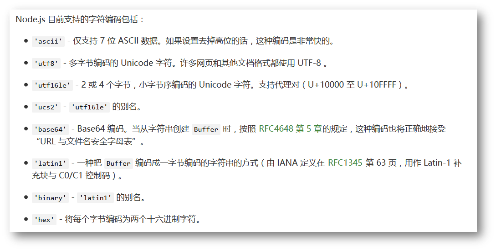
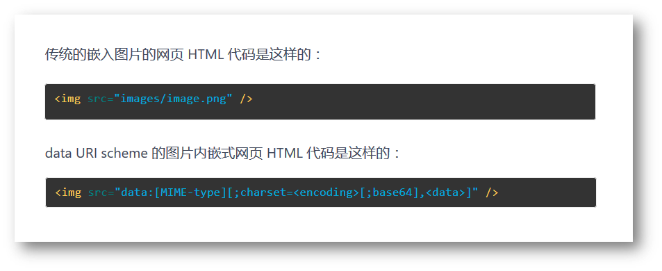
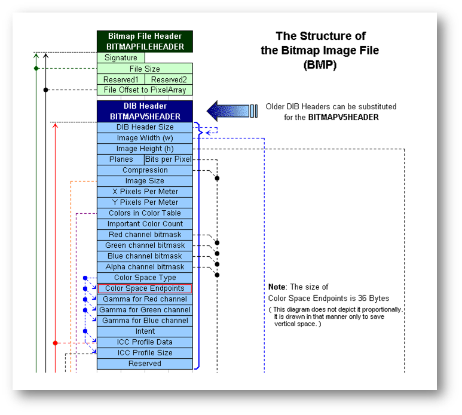
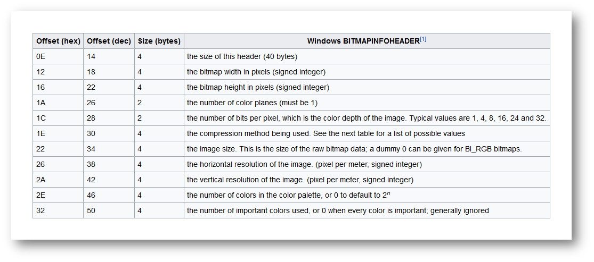

### Node.js Buffer(缓冲区)

JavaScript 语言自身只有字符串数据类型，没有二进制数据类型。

但在处理像TCP流或文件流时，必须使用到二进制数据。因此在 Node.js中，定义了一个 Buffer 类，该类用来创建一个专门存放二进制数据的缓存区。

在 Node.js 中，Buffer 类是随 Node 内核一起发布的核心库。Buffer 库为 Node.js 带来了一种存储原始数据的方法，可以让 Node.js 处理二进制数据，每当需要在 Node.js 中处理I/O操作中移动的数据时，就有可能使用 Buffer 库。原始数据存储在 Buffer 类的实例中。一个 Buffer 类似于一个整数数组，但它对应于 V8 堆内存之外的一块原始内存。

#### Buffer基本操作

- 实例化一个 buffer 对象 buf1，缓冲区的大小是 256 字节，初始化第一个字节为23，控制台打印 buf1 的长度和内容
- 通过循环初始化 buf1 的每个字节，每个字节比上个字节大 1，控制台打印 buf1 的内容
- 对 buf1 做切片操作，取出后 10 个字节，存放到 buf2 中，控制台打印 buf2 的内容和长度
- 对 buf2 做填充操作，所有字节填充为零，控制台打印 buf2 的内容
- 用数组（数组内容随意）初始化 buf3，控制台打印 buf3 中的内容和长度
- 用字符串（字符串内容随意）初始化 buf4，控制台打印 buf4 中的内容和长度，打印 buf4 字符串
- 将 buf4 的内容复制到 buf3 中，打印复制后的 buf3 内容和长度，打印 buf3 字符串

```javascript
#!/usr/bin/node
// 初始化对象 new Buffer()
const log = console.log;
var buf1 = new Buffer(256);
buf1[0] = 23;
log('buf1 length:',buf1.length);
log('buf2 content:',buf1);

// 循环初始化
for(var i = 0;i<buf1.length;i++) buf1[i] = i;
log('buf1 new content:',buf1);

// 切片填充操作
var buf2 = buf1.slice(246,257);
log('buf2 length:',buf2.length);
log('buf2 new content:',buf2);
buf2.fill(0);
log('buf2 fill content:',buf2);

// 数组进行初始化
var arr = ['a',0xBA,0xDF,0x00,0x00,255,10];
var buf3 = new Buffer(arr,'utf-8');
log('buf3 length:',buf3.length);
log('buf3 content:',buf3);

// 字符串初始化
var buf4 = new Buffer('Hello World','utf-8');
log('buf4 length:',buf4.length);
log('buf4 content:',buf4);
log('buf4 string content:',buf4.toString('utf-8'));

// 复制内容
buf3.copy(buf4);
log('buf3 length:',buf3.length);
log('buf3 content:',buf3);
/*
buf.copy(targetBuffer[, targetStart[, sourceStart[, sourceEnd]]])
参数描述如下：
targetBuffer - 要拷贝的 Buffer 对象。
targetStart - 数字, 可选, 默认: 0
sourceStart - 数字, 可选, 默认: 0
sourceEnd - 数字, 可选, 默认: buffer.length
*/
```

### Buffer 编码

在计算机中，文件的编码有两种方式，一种方式是通过文本文件进行编码（例如：`utf-8 ascii utf16le`），另一种方式是通过二进制文件进行编码的（例如：`base64 lantin1 hex`）



其中对于`base64`编码是从二进制到字符的过程，可用于在[HTTP](https://baike.baidu.com/item/HTTP)环境下传递较长的标识信息。采用Base64编码具有不可读性，需要解码后才能阅读。

HTTP对于用户名和密码的校验主要通过两种方式

+ 基本校验：用户名和密码之间通过冒号`  ：` 进行分隔，之后通过`base64`编码形成加密文件，上传至服务器，服务器通过解密进行解密
+ 摘要校验：通过MD5码进行校验

**任务要求：**

- 从命令行参数获取登录网站的用户名和密码信息
- 命令行参数的格式：`cmd user_name password`
- 命令行参数不正确时，提示用户命令行参数的正确格式
- 在控制台打印用户名和密码信息
- 将用户名和密码信息拼接成一个字符串，用冒号（:）分割
- 将拼接后的字符串转化成 base64 编码，并打印在控制台上

```javascript
#!/usr/bin/node
if(process.argv.length !== 4){
  console.log('请输入正确的参数个数');
  process.exit(-1);
}
const name = process.argv[2],
      pwd = process.argv[3];
if(name == '' || pwd == ''){
  console.log('请输入正确的参数！');
  process.exit(-1);
}
var str = name + ':' + pwd;
var buf = new Buffer(str);
console.log("base64 content:",buf.toString('base64'));
```

### Buffer 解码

- 从命令行参数获取用户名和密码信息的 base64 编码字符串
- 命令行参数的格式：`cmd base64_string`
- 命令行参数不正确时，提示用户命令行参数的正确格式
- 将 base64 编码的字符串转换成 utf8 编码的字符串
- 将还原后的用户名和密码信息打印在控制台上
- 还原信息不正确时，请提示错误信息

```javascript
#!/usr/bin/node

if(process.argv.length !== 3 || process.argv[2] == ''){
  console.log('请按照命令行参数的格式：cmd base64_string输入合法的参数');
  process.exit(-1);
}
const str = process.argv[2];
var buf = new Buffer(str,'base64');// 后面的编码格式不能缺少
var namepwd = buf.toString('utf-8');
var data = namepwd.split(':');
if(data.length !== 2){
  console.error('信息有误！');
  process.exit(-1);
}
console.log("name:" + data[0] + ' pwd:' + data[1]);
```

### Buffer 实现 Data URI

DATA－URI 是指可以在Web 页面中包含图片但无需任何额外的HTTP 请求的一类URI.（类似将图片的base64码添加到`src`属性上）



- 从命令行参数获取图片文件名
- 命令行参数的格式：`cmd file_name`
- 命令行参数不正确时，提示用户命令行参数的正确格式
- 命令行参数的图片文件不存在时，提示错误信息
- 把图片数据生成 data URI 格式的数据
- 把 data URI 数据打印到控制台
- 把 data URI 数据嵌入到 HTML 页面中
- 创建一个 HTTP 服务，监听 8080 端口
- 浏览器请求 HTTP 服务的 URL 地址时，得到嵌入图片数据的 HTML 页面

任务提示：

```markdown
> 文件操作需要导入 fs 模块： const fs = require('fs');
> 读取文件数据可以使用 readFileSync 方法：var data = fs.readFileSync(fileName);
> 同步读取文件时，如果文件不存在会抛出异常，可以使用 try-catch 捕获异常
> 获取文件扩展名，需要导入 path 模块：const path = require('path');
> 获取文件扩展名使用 path 模块的 extName 方法：var ext = path.extname(fileName);
```

```javascript
const http = require('http'),
      fs = require('fs'),
      path = require('path');
var filename = process.argv[2];
if(process.argv.length !== 3) {
  console.error('命令行参数格式：cmd fileName');
  process.exit(-1);
}
try {
  var data = fs.readFileSync(filename).toString('base64');
} catch(e) {
  console.error(e.message);
  process.exit(-1);
}
var ext = path.extname(filename);
var datauri = 'data:img/' + ext.slice(1,ext.length) + ';base64,' + data;
html = '<!DOCTYPE html><html><head><title>img</title></head><body></body></html>';
http.createServer((req,res)=>{
  	res.end(html);
}).listen(8080);
// 这样做的意义在哪里
/*
如果对于一个页面有10个小图片，那么客户端需要请求多次服务器，很浪费带宽，但是如果用data uri则可以减少带宽，有助于网页的优化
*/
```

### Buffer 读取位图信息

读取一个BMP文件，需要知道二进制文件的存储的三方面内容：

+ 位置：也就是对应的偏移量（相较于第一个位置的偏移量） `offset` 
+ 大小：4byte 8byte
+ 含义：这一个字段代表是什么含义



下列显示的所对应的offset以及size：



任务要求：

- 从命令行参数获取图片文件名
- 命令行参数的格式：`cmd file_name`
- 命令行参数不正确时，提示用户命令行参数的正确格式`(length)`
- 命令行参数的图片文件不存在时，提示错误信息`(try catch)`
- 获取图片的宽度、高度和颜色深度三个信息，并打印在控制台上

```javascript
#!/usr/bin/node

const filename = process.argv[2],
      fs = require('fs'),
      buf = fs.readFileSync(filename),
      log = console.log;
log('BMP width:',buf.readUInt32LE(18));
log('BMP Height:',buf.readUInt32LE(22));
log('color deapth:',buf.readUInt16LE(28));
/*
buf.readUInt32LE(offset[, noAssert])
根据指定的偏移量，使用指定的 endian 字节序格式读取一个无符号 32 位整数，小端对齐。 若参数 noAssert 为 true 将不会验证 offset 偏移量参数。 这意味着 offset 可能会超出buffer 的末尾。默认是 false。
*/
```

### Buffer 写入位图文件

- 从命令行参数获取图片文件名
- 命令行参数的格式：`cmd file_name`
- 命令行参数不正确时，提示用户命令行参数的正确格式
- 写一个 16 * 16 像素，颜色深度为 32 位的位图文件
- 位图的所有像素为红色

```javascript
#!/usr/bin/node

const fs = require('fs');

const width = 16,
      height = 16;

var pixelByteSize = width * height * 4;
var totalSize = pixelByteSize + 54;

var buf = new Buffer(totalSize);

buf.fill(0);

// head
buf.write('BM');
buf.writeUInt32LE(totalSize, 0x02);
buf.writeUInt32LE(54, 0x0a);
buf.writeUInt32LE(40, 0x0e);
buf.writeUInt16LE(1, 0x1a);
buf.writeUInt16LE(32, 0x1c);
buf.writeUInt32LE(pixelByteSize, 0x22);
buf.writeInt32LE(width, 0x12);
buf.writeInt32LE(height, 0x16);

// data
for(var i=54; i<totalSize; i+=4) {
   buf.writeUInt32LE(0xff0000ff, i);
}

fs.writeFile('./out.bmp', buf, (err) => {
    if(err != null) {
      console.error(err);
      process.exit(1);
    }
});
```

