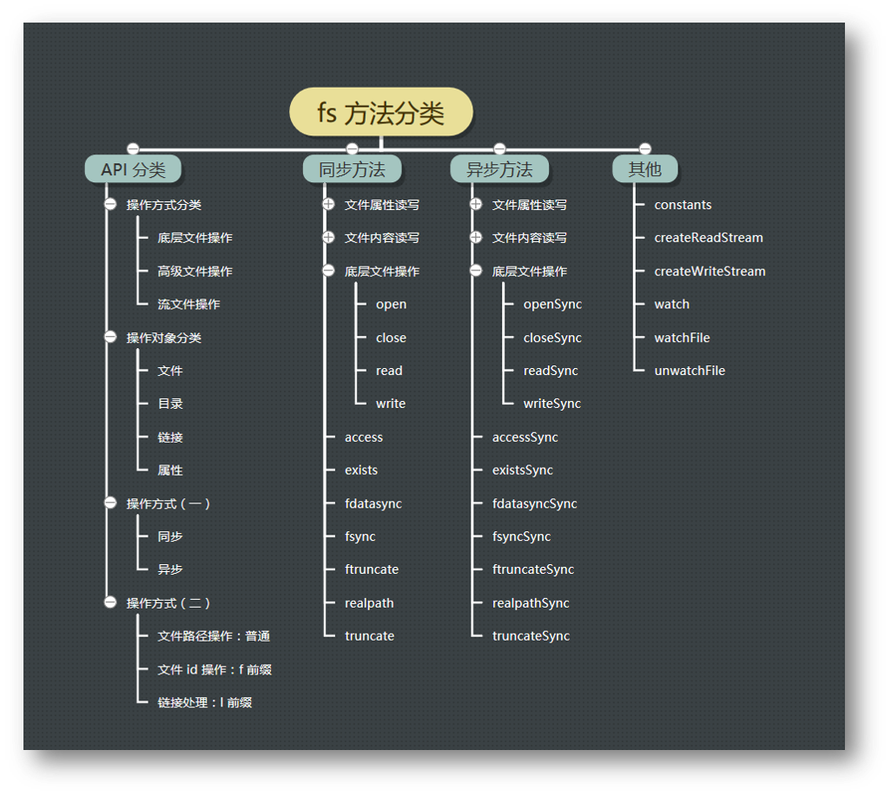
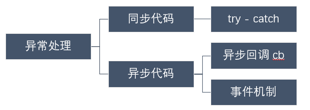

#### Node.js 文件系统简介

在软件工程的定义里面：`Software = program + document` （其中`document`分为内部文档和外部文档）

其中程序又可以分为数据结构和算法，数据结构的主要体现是在一个程序设计时，而在我们运行和编码一个程序的时候，我们需要运用数据（其中数据分为内部数据和外部数据），在数据中外部文件就是我们所说的**文件** `fs`

##### fs方法分类

+ 从操作方式上进行分类：底层文件操作、高级文件操作、流文件操作

+ 从操作对象上进行分类：文件、目录、链接、属性

+ 从操作的方式上进行分类：同步（同步的方法一般加上sync）和异步

  **说明：**当文件比较大的时候，一般会用异步的方式（流）进行操作，当文件比较小的时候，会用同步的方式进行**建议大家使用异步方法，比起同步，异步方法性能更高，速度更快，而且没有阻塞。**



#### 异常处理

我们常见的异常大致分为：语法错误、逻辑错误、运行时错误

对待异常处理要有全局意识，避免未知性的错误



```javascript
/*
1. 同步代码
try{
  console.log(fs.readFileSync(file).toString('utf-8'));
}catch(err){
  console.log(err.message,err.name);
  process.exit(-1);
}
2. 异步处理
fs.readFile(file,(err,data)=>{
  if(err) {
    console.log('Sorry,Something Woring!');
    process.exit(100);
  }else{
    console.log(data.toString('utf-8'));
  }
})
3. 事件机制
src.on('error',(err)=>{
  console.log(err.message);
  process.exit(1);
})
*/
```

#### 打印文件内容

##### 异步的打印文件内容

- 要求支持命令行参数，包括：要打印的文件名
- 没有命令行参数时，默认打印脚本本身内容
- 文件不存在则打印错误信息
- 文件存在则在控制台打印文件内容
- 用异步方式读取文件内容

```javascript
#!/usr/bin/node

const fs = require('fs');

var file = process.argv[2] || __filename;

fs.readFile(file,(err,data)=>{
  if(err){
  	console.log(err.message);
    process.exit(1);
  }else{
  	console.log(data.toString('utf-8'));
  }
})
```

##### 底层的打印文件内容

- 要求支持命令行参数，包括：要打印的文件名
- 没有命令行参数时，默认打印脚本本身内容
- 文件不存在则打印错误信息
- 文件存在则在控制台打印文件内容
- 用底层 API 打开文件，再同步读取文件内容

```javascript
#!/usr/bin/node

const fs = require('fs');
var file = process.argv[2] || __filename;

var fid = fs.openSync(file,'r');

var len = fs.statSync(file).size;
var buf = new Buffer(len);
fs.readSync(fid,buf,0,len);
console.log(buf.toString('utf-8'));

fs.closeSync(fid)
/*
打开文件的操作：
fs.open(path, flags[, mode], callback)
fs.openSync(path, flags[, mode]) // 异常处理需要使用try catch
flags 可以是：
r读 w写 a追加
'r' - 以读取模式打开文件。如果文件不存在则发生异常。
'r+' - 以读写模式打开文件。如果文件不存在则发生异常。
'rs+' - 以同步读写模式打开文件。命令操作系统绕过本地文件系统缓存。
mode 可设置文件模式（权限和 sticky 位），但只有当文件被创建时才有效。默认为 0o666，可读写。

获取文件信息操作：
fs.stat(path, callback)  获取文件信息 path - 文件路径。callback - 回调函数，带有两个参数如：(err, stats), stats 是 fs.Stats 对象

返回读取字节的数量：
fs.readSync(fd, buffer, offset, length, position) 返回读取字节的数量

关闭文件的操作：
fs.close(fd, callback)：callback <Function>：err <Error>异步的 close(2)。 完成回调只有一个可能的异常参数。
*/
```

##### 同步的打印文件内容

- 要求支持命令行参数，包括：要打印的文件名
- 没有命令行参数时，默认打印脚本本身内容
- 文件不存在则打印错误信息
- 文件存在则在控制台打印文件内容
- 用同步的方式读取文件内容并将文件内容输出到控制台上

```javascript
#!/usr/bin/node

const fs = require('fs');
var file = process.argv[2] || __filename;

try{
  console.log(fs.readFileSync(file).toString('utf-8'));
}catch(err){
  console.log(err.message);
  process.exit(1);
}
/*fs.readFileSync(path[, options])
如果指定了 encoding 选项，则该函数返回一个字符串，否则返回一个 buffer。*/
```

##### 流的打印文件内容

- 要求支持命令行参数，包括：要打印的文件名
- 没有命令行参数时，默认打印脚本本身内容
- 文件不存在则打印错误信息
- 文件存在则在控制台打印文件内容
- 用流的方式读取文件内容并将管道接入到标准输出流上

```javascript
#!/usr/bin/node

const fs = require('fs');
var file = process.argv[2] || __filename;

var readStream = fs.createReadStream(file);
readStream.on('error',(err)=>{console.log(err.message);process.exit(-1);});
readStream.on('open',function(){this.pipe(process.stdout)});
// 处理错误异常要有全局意识
fs.createReadStream(file).pipe(process.stdout);

process.on('uncaughtException',(err)=>{
  console.log(err.message);
  process.exit(1);
})

/*
fs.createReadStreame()这个api的作用是打开一个可读的文件流并且返回一个fs.ReadStream对象
let readStream=fs.createReadStream('./test/b.js',{encoding:'utf8'});
//console.log(readStream);

//读取文件发生错误事件
readStream.on('error', (err) => {
    console.log('发生异常:', err);
});
//已打开要读取的文件事件
readStream.on('open', (fd) => {
    console.log('文件已打开:', fd);
});
//文件已经就位，可用于读取事件
readStream.on('ready', () => {
    console.log('文件已准备好..');
});
 
//文件读取中事件·····
readStream.on('data', (chunk) => {
    console.log('读取文件数据:', chunk);
});
 
//文件读取完成事件
readStream.on('end', () => {
    console.log('读取已完成..');
});
 
//文件已关闭事件
readStream.on('close', () => {
    console.log('文件已关闭！');
});
*/
```

##### 混合的打印文件内容

- 要求支持命令行参数，包括：要打印的文件名
- 没有命令行参数时，默认打印脚本本身内容
- 文件不存在则打印错误信息
- 文件存在则在控制台打印文件内容
- 用底层 API 打开文件，再同步读取文件内容
- 用 writeSync 向控制台输出文件内容

```javascript
#!/usr/bin/node

const fs = require('fs');
var file = process.arv[2] || __filename;

var fd = fs.openSync(file,'r');

fs.writeSync(1,fs.readFileSync(file).toString('utf-8'));
fs.closeSync(fd);
```

##### 复制文件

- 要求支持命令行参数，包括：要复制的源文件名和目标文件名
- 源文件不存在则打印错误信息
- 除了能复制文件内容，还需要复制文件权限（未实现）

```javascript
#!/usr/bin/node

const fs = require('fs');

var src = process.argv[2],
    dst = process.argv[3];

fs.writeFileSync(dst,fs.readFileSync(src));
```

##### 移动文件

- 要求支持命令行参数，包括：要移动的源文件名和目标文件名
- 源文件不存在则打印错误信息
- 除了能移动文件，可以修改文件名

```javascript
#!/usr/bin/node

const fs = require('fs');

var src = process.argv[2],
    dst = process.argv[3];

fs.renameSync(src,dst);
```

##### 删除文件

- 要求支持命令行参数，包括：要删除的文件名
- 文件不存在打印错误信息
- 文件存在则删除
- 如果命令行参数指定的是一个目录，则忽略他

```javascript
#!/usr/bin/node

const fs = require('fs');

var file = process.argv[2];

fs.unlinkSync(file);// rm
```

##### 创建空文件

- 要求支持命令行参数，包括：要创建的文件名
- 创建指定名称的文件
- 文件的长度为 0 字节

```javascript
#!/usr/bin/node

const fs = require('fs');

var file = process.argv[2];

fs.appendFileSync(file);
```

