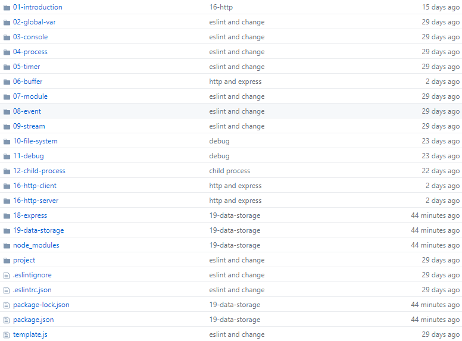

# node.js
:christmas_tree:  node.js学习，该模块主要展示node.js相关学习资料，这些资料只不过是个人根据老师的授课内容进行整理，请大家监督，如果有什么问题可以随时进行更正。

> 说明：本内容依据王顶老师的[node.js应用开发课程](https://nodejs.wangding.in/) 本仓库内容含 Node.js 应用开发课程的全部学习资料，包括：课程学习资料、学习心得、学习示例代码、个人学习项目案例。

## node.js学习大纲

+ node.js简介
  + [搭建开发环境](https://github.com/fuziwang/node.js/blob/master/nodejs-course/01-1%20%E6%90%AD%E5%BB%BA%E5%BC%80%E5%8F%91%E7%8E%AF%E5%A2%83.md)（基于mocha虚拟机和xshell软件进行开发，使用vim编辑器进行node.js开发，基于Linux环境）
  + [vim基本使用规则](https://github.com/fuziwang/node.js/blob/master/nodejs-course/01-2%20vim%E7%9A%84%E4%BD%BF%E7%94%A8.md)（常见的复制、粘贴、删除、切换操作）
  + [node.js简介](https://github.com/fuziwang/node.js/blob/master/nodejs-course/01-3%20node.js%E7%AE%80%E4%BB%8B.md)（node.js的概念、node.js架构、node.jsAPI、node.js特点）

+ node.js全局API
  + [路径变量和控制台](https://github.com/fuziwang/node.js/blob/master/nodejs-course/02-1%20%E5%85%A8%E5%B1%80%EF%BC%88%E4%B8%8A%EF%BC%89file-dir-console.md)（`__filename` `__dirname` `console`）
  + [进程](https://github.com/fuziwang/node.js/blob/master/nodejs-course/02-2%20%E5%85%A8%E5%B1%80%EF%BC%88%E4%B8%8A%EF%BC%89process.md) 
  + [定时器](https://github.com/fuziwang/node.js/blob/master/nodejs-course/02-3%20%E5%85%A8%E5%B1%80%EF%BC%88%E4%B8%8A%EF%BC%89time.md) 
  + [Buffer](https://github.com/fuziwang/node.js/blob/master/nodejs-course/03-1%20%E5%85%A8%E5%B1%80%EF%BC%88%E4%B8%8B%EF%BC%89Buffer.md) （缓冲区）
  + [module模块管理](https://github.com/fuziwang/node.js/blob/master/nodejs-course/03-2%20%E5%85%A8%E5%B1%80%EF%BC%88%E4%B8%8B%EF%BC%89module.md)

+ [node.js事件](https://github.com/fuziwang/node.js/blob/master/nodejs-course/04%20%E4%BA%8B%E4%BB%B6.md)（`EventEmitter` 原型继承 util继承）

+ [node.js流](https://github.com/fuziwang/node.js/blob/master/nodejs-course/05%20%E6%B5%81.md)（流的概念、流的分类、可读流、可写流）
+ [文件系统fs模块](https://github.com/fuziwang/node.js/blob/master/nodejs-course/06%20%E6%96%87%E4%BB%B6%E7%B3%BB%E7%BB%9F.md) （fs方法分类、fs文件操作、fs目录操作、fs链接操作）
+ [调试debug](https://github.com/fuziwang/node.js/blob/master/nodejs-course/07%20%E8%B0%83%E8%AF%95.md) （调试分类、静态代码检查）
  + 补充内容：[nvm工具](https://github.com/fuziwang/node.js/blob/master/nodejs-course/%E5%AE%89%E8%A3%85node%E7%89%88%E6%9C%AC%E5%B7%A5%E5%85%B7%E4%B9%8Bnvm.md)
+ [子进程](https://github.com/fuziwang/node.js/blob/master/nodejs-course/08%20%E5%AD%90%E8%BF%9B%E7%A8%8B.md) （调用外部程序、子进程分离、fork）
+ HTTP网络编程
  + [HTTP客户端编程](https://github.com/fuziwang/node.js/blob/master/nodejs-course/09%20HTTP%E7%BD%91%E7%BB%9C%E7%BC%96%E7%A8%8B%EF%BC%88%E5%AE%A2%E6%88%B7%E7%AB%AF%EF%BC%89.md) （HTTP协议、GET POST方法、抓包项目、重定向）
  + 补充内容：[Content-Type](https://github.com/fuziwang/node.js/blob/master/nodejs-course/Content-Type.md)
  + [HTTP服务端编程v1](https://github.com/fuziwang/node.js/blob/master/nodejs-course/09%20HTTP%E7%BD%91%E7%BB%9C%E7%BC%96%E7%A8%8B%EF%BC%88%E5%AE%A2%E6%88%B7%E7%AB%AF%EF%BC%89.md) （解析HTTP方法、解析URL、处理HTTP响应、处理上传数据）
  + [HTTP服务端编程v2](https://github.com/fuziwang/node.js/blob/master/nodejs-course/10%20HTTP%E7%BD%91%E7%BB%9C%E7%BC%96%E7%A8%8B%EF%BC%88%E6%9C%8D%E5%8A%A1%E7%AB%AF%EF%BC%89v2.md) （GET POST处理form表单、处理文件上传、后台模板渲染）

+ [Express框架](https://github.com/fuziwang/node.js/blob/master/nodejs-course/11%20Express%20%E6%A1%86%E6%9E%B6.md) （Express模块、Express代码生成器、`TodoList`）
+ [数据存储](https://github.com/fuziwang/node.js/blob/master/nodejs-course/12%20%E6%95%B0%E6%8D%AE%E5%AD%98%E5%82%A8.md) （数据库存储、MySQL、`Todolist`）

+ 补充：[Ajax内容](https://github.com/fuziwang/node.js/blob/master/nodejs-course/Ajax.md)

## node.js学习demo

示例代码：https://github.com/fuziwang/node.js/tree/master/nodejs-demo

## node.js进阶

+ node.js聊天室：基于socket.io（简单的多人通信）
  + n[ode.js搭建聊天室技术文档](https://github.com/fuziwang/node.js/blob/master/nodejs-course/Node.js%E8%81%8A%E5%A4%A9%E5%AE%A4.md)
  + [node.js-demo-chat](https://github.com/fuziwang/node.js/tree/master/nodejs-demo/chat)

+ node.js文件上传：基于express的中间件（multer）
  + [NodeJS express+multer实现文件上传技术文档](https://github.com/fuziwang/node.js/blob/master/nodejs-course/NodeJS%20express%2Bmulter%E5%AE%9E%E7%8E%B0%E6%96%87%E4%BB%B6%E4%B8%8A%E4%BC%A0.md)
  + [node.js-demo-file](https://github.com/fuziwang/node.js/tree/master/nodejs-demo/file)

## 联系我

如果你想提出一些意见，加入我的知识原地，贡献自己的一部分力量，请联系我。

- 如果你是河北师范大学的学生，请直接联系我。QQ：2622860598
- 如果你是外校学生，你只需要提供`github username` 发送到[2622860598@qq.com](mailto:209702737@qq.com)
- 如果你是技术大牛，请止步，这里是技术小白的天堂

