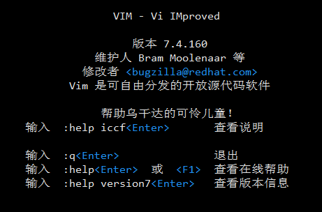

#### vi简介

vim文本文件编辑，vi是命令行界面下的文字处理软件，目前，主流的文字处理软件有：`vim, emacs, nano`  

vi 是`visual`的缩写，vim是`visual improved`的缩写

```bash
~ » type vi                                             wangding@OFFICE
vi is an alias(别名) for vim
------------------------------------------------------------
~ » file /usr/bin/vi                                    wangding@OFFICE
/usr/bin/vi: ELF 64-bit LSB executable, x86-64, version 1 (SYSV), dynamically linked (uses shared libs), for GNU/Linux 2.6.32, BuildID[sha1]=97a17f3a9bea3d8c0490c12247b5e89c47cbcd28, stripped
```

#### vim的使用

##### :one: start and stop vi

在命令行模式下输入vim 或者 vim model.js 即可启动vi

```bash
~ » vim                                                 wangding@OFFICE # 保存后会创建一个新的文件
------------------------------------------------------------
~ » vim model.js                                        wangding@OFFICE # 会创建一个新的文件
```



在命令行模式下输入`:q` 退出 `:q!` 强制退出（不关心发生的改变） `:wq` 保存并退出 `:w` 保存

##### :two: edit model

vim 存在`normal`模式和`insert`模式。

```markdown
# normal模式向insert模式进行转变的方式：
+ insert模式向normal模式 a append i insert
+ normal模式向insert模式 esc escape
```

##### :three: normal模式下的光标移动按键操作

| 按键                  | 移动光标                           |
| ------------------- | ------------------------------ |
| l or 右箭头            | 向右移动一个字符                       |
| h or 左箭头            | 向左移动一个字符                       |
| j or 下箭头            | 向下移动一行                         |
| k or 上箭头            | 向上移动一行                         |
| 0 (零按键)             | 移动到当前行的行首。                     |
| ^                   | 移动到当前行的第一个非空字符。                |
| $                   | 移动到当前行的末尾。                     |
| w                   | 移动到下一个单词或标点符号的开头。              |
| W                   | 移动到下一个单词的开头，忽略标点符号。            |
| b                   | 移动到上一个单词或标点符号的开头。              |
| B                   | 移动到上一个单词的开头，忽略标点符号。            |
| Ctrl-f or Page Down | 向下翻一页                          |
| Ctrl-b or Page Up   | 向上翻一页                          |
| numberG             | 移动到第 number 行。例如，1G 移动到文件的第一行。 |
| G                   | 移动到文件末尾。                       |

:evergreen_tree: 移动光标键是可以和数字进行结合的，比如5j 就是向移动了5个单位（即移动了5行）

##### :four: edit file

普通模式中，在当前光标后追加文本的快捷键是什么？在行位追加文本的快捷键是什么？在行首追加文本的快捷键是什么？

```
a 在当前光标的后一个单词进行追加 a(追加)ppen
A 在当前光标的行末进行追加
i 在当前光标的前一个单词进行追加 (追加)appen
I 在当前光标的行首进行追加
```

| 命令   | 打开行         |
| ---- | ----------- |
| o    | 当前行的下方打开一行。 |
| O    | 当前行的上方打开一行。 |

##### :five: edit delete

| 命令   | 删除的文本                |
| ---- | -------------------- |
| x    | 当前字符                 |
| 3x   | 当前字符及其后的两个字符。        |
| dd   | 当前行。                 |
| 5dd  | 当前行及随后的四行文本。         |
| dW   | 从光标位置开始到下一个单词的开头。    |
| d$   | 从光标位置开始到当前行的行尾。      |
| d0   | 从光标位置开始到当前行的行首。      |
| d^   | 从光标位置开始到文本行的第一个非空字符。 |
| dG   | 从当前行到文件的末尾。          |
| d20G | 从当前行到文件的第20行。        |

##### :six: edit copy

> `yy`代表的是复制操作，p是进行粘贴的操作，其中P表示在当前行的前一行进行复制

| 命令   | 复制的内容                |
| ---- | -------------------- |
| yy   | 当前行。                 |
| 5yy  | 当前行及随后的四行文本。         |
| yW   | 从当前光标位置到下一个单词的开头。    |
| y$   | 从当前光标位置到当前行的末尾。      |
| y0   | 从当前光标位置到行首。          |
| y^   | 从当前光标位置到文本行的第一个非空字符。 |
| yG   | 从当前行到文件末尾。           |
| y20G | 从当前行到文件的第20行。        |

##### :seven: search and replace

| 条目         | 含义                                       |
| ---------- | ---------------------------------------- |
| :          | 冒号字符运行一个 ex 命令。                          |
| %          | 指定要操作的行数。% 是一个快捷方式，表示从第一行到最后一行。另外，操作范围也可以用 1,5 来代替（因为我们的文件只有5行文本），或者用 1,$ 来代替，意思是 “ 从第一行到文件的最后一行。”如果省略了文本行的范围，那么操作只对当前行生效。 |
| s          | 指定操作。在这种情况下是，替换（查找与替代）。                  |
| /Line/line | 查找类型与替代文本。                               |
| g          | 这是“全局”的意思，意味着对文本行中所有匹配的字符串执行查找和替换操作。如果省略 g，则只替换每个文本行中第一个匹配的字符串。 |

```bash
:%s/lang/frewen/g
# 将所有的lang替换为frewen
```

替换确认按键

| 按键             | 行为                         |
| -------------- | -------------------------- |
| y              | 执行替换操作                     |
| n              | 跳过这个匹配的实例                  |
| a              | 对这个及随后所有匹配的字符串执行替换操作。      |
| q or esc       | 退出替换操作。                    |
| l              | 执行这次替换并退出。l 是 “last” 的简写。  |
| Ctrl-e, Ctrl-y | 分别是向下滚动和向上滚动。用于查看建议替换的上下文。 |

##### :eight: edit one more file

+ 同时打开多个文档 `vi file-name1 file-name2`


+ 文档之间的切换 `:n` 切换到下一个文档 `:N` 切换到上一个文档


+ 在插入模式下如何前、后、上、下，移动光标：`ctrl-f, ctrl-b, ctrl-p, ctrl-n`  


+ 在插入模式下快捷键如何删除当前光标前的一个单词？如何删除当前光标到行首？如何删除当前光标到行尾？

```
ctrl-w, ctrl-u, ctrl-k  
```

