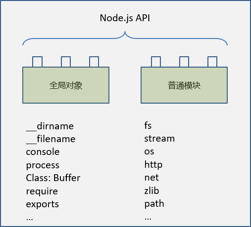
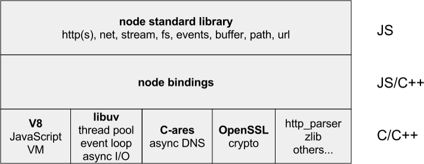
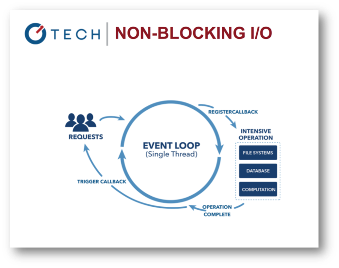

#### node.js是什么

`node.js`是一个基于 chrome v8 引擎的 JavaScript 运行环境


node.js 作为 JavaScript 的运行环境，包括两层含义

+ `JavaScript` 通过 `node.js` 在服务器上运行，这样 `node.js` 好像就是 `JavaScript` 的虚拟机
+ `node.js` 提供大量的 API，使 `JavaScript` 语言与操作系统互动（读写文件、创建进程）

node 和 console控制台的区别：

+ 在console控制台中全局变量是window变量、输入process会报错
+ 在node中如果打window变量则会报错、node中的全局变量是process

#### node.js API

node.js API包含两个部分：全局对象和普通模块（我们学习主要学习的是node.js 的API）



#### node.js 架构



如上图所示，node.js 架构分为三层：

+ 顶层是 node.js 标准库，例如：fs，stream等模块
+ 中间层是node.js 绑定层，连接底层的V8 和 顶层的node.js 的标准库，起到桥梁的作用
+ 底层有 V8，libuv 等模块，是通过C/C++进行编写的

#### node.js 的特点

node.js 使用了事件的驱动以及非阻塞的I/O的模型使其轻量又高效



##### 阻塞 I/O 和非阻塞 I/O

+ 阻塞 I/O 意味着一个或多个请求在处理时要排队（多线程）
+ 非阻塞 I/O ，采用事件轮询的异步模式（单线程）

```markdown
可以理解成：同学们有问题，阻塞 I/O 相当于课上提问，一个一个的来；
非阻塞 I/O 相当于在线上，所有同学把问题发到 QQ 群里，然后老师解决了哪个，就把答案发给谁。  
```

#### 编写 hello world 命令行程序

- 创建 nodejs-demo 目录
- 把 .tern-project 代码自动补全配置文件，放到 nodejs-demo 目录下，操作方法如下：
  - 在 nodejs-demo 目录下，运行 `wget https://sample.wangding.in/nodejs/tern-project`
  - 在 nodejs-demo 目录下，运行 `mv tern-project .tern-project`
- 创建 01-introduction 目录
- 编写 01-hello-world.js
- 在命令行打印 `hello world!` 字符

```javascript
#!/usr/bin/node

console.log('Hello World!');
```

+ 在 node.js 中运行某个脚本文件的命令是 `node file-name`


+ REPL 是什么？如何进入 REPL 模式？

```markdown
Read-Eval-Print-Loop 四个单词的首字母缩写，意思是：读取-求值-输出-循环。执行 node 命令，进入 REPL 模式。  
```

+ 退出 REPL 模式  `Ctrl+D`  


+ 运行 node.js 脚本文件时要省略 node 命令，如何操作

```markdown
在脚本代码前面加入#!/usr/bin/node，并对脚本文件增加可执行权限
增加 linux 文件的可执行权限 chmod u+x file-name  
```

#### 编写 hello world web 程序

- 编写 02-hello-world-server.js
- 监听端口：8080
- 当收到 HTTP 请求时，发送响应文本 `hello world!`
- 用浏览器测试 web 程序
- 用 curl linux 命令行程序测试 web 程序

```javascript
#!/usr/bin/node

var http = require('http');
http.createServer(function(req,res)=>{
  res.write('abc');
  res.end('hello world');
}).listen(8080);

# 执行结果
res.write()和res.end()都会返回给浏览器
```

#### node.js的版本

- node.js中偶数位的版本为稳定版本 `-0.6.x -0.8.x -0.10.x`
- node.js中奇数位的版本为非稳定版本 `-0.7.x -0.9.x -0.11.x`