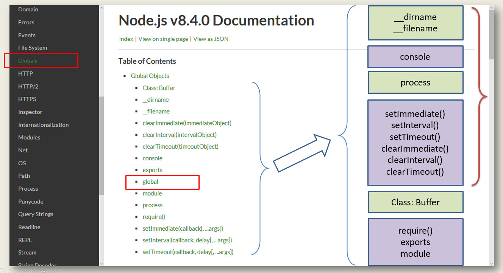

#### 全局对象API预览



#### 全局：路径变量

- __filename：展示当前的文件名称，从主目录开始的绝对路径
- __dirname：展示当前文件所在的文件目录的名称，从主目录开始的绝对路径


**任务要求：**

- 在控制台输出 `__filename` 和 `__dirname` 两个变量
- 完成项目目录下，'views' 子目录中，网页模板 'view.html' 的路径拼接
- 在控制台输出拼接后的路径信息

```javascript
#!/usr/bin/node

console.log("filename:",__filename);
console.log("dirname:",__dirname);

/*在文件操作的时候，可以进行目录的拼接，可以用一个文件的绝对路径和相对路径从而得到一个文件的绝对路径*/

/*method1*/
var file = __dirname + "/view/base.html";// 这种方法并没有考虑不同的操作系统

/*method2*/
var file;
switch(process.platform){
  case "Linux":
    file = __dirname + "/view/base.html";
    break;
  case "win32":
    file = __dirname + "\\view\\base.html";
    break;
  default:
    file = "error";
}

/*method3*/
const path = require("path");
file = path.join(__dirname,"view","base.html");

## 输出结果
filename: /home/wangding/node.js/nodejs-demo/02-global-var/01-file-dir-name.js
dirname: /home/wangding/node.js/nodejs-demo/02-global-var
```

#### 全局：控制台

##### 控制台输出信息

console控制台：`console`用于提供控制台标准输出，它是一种调试工具，后来逐渐成为了标准

| 方法                | 描述                               |
| ----------------- | -------------------------------- |
| `console.log()`   | 向标准输出流打印字符并以换行符结束                |
| `console.info()`  | 向标准输出流打印信息性消息。输出文字外，会显示一个蓝色的惊叹号。 |
| `console.warn()`  | 向标准输出流打印警告性消息。输出文字外，会显示一个黄色的惊叹号。 |
| `console.error()` | 向标准输出流打印错误性消息。输出文字外，会显示一个红色的叉子。  |

**任务要求：**

- 定义一个 user 对象，包含三个字段：name, age, qq

- 使用三种占位符，分别输出三种变量类型：字符串，整数和 JSON 数据

- 以两种不同占位符的方式输出 `user.qq` 信息

- 向标准错误流中输出信息：`Error：something wrong!`

- 通过命令行重定向，观察 console.log 和 console.error 两个方法所使用流的区别

  ```
  ./01-format.js > output.txt
  ./01-format.js 2> error-msg.txt
  ```

```javascript
#!/usr/bin/node

const user = {
  name:"frewen",
  age:21,
  qq:"2622860598"
};

const log = console.log;

//method1
log("name: %s",user.name); // string类型
log("age: %d",user.age); // number类型
log("user: %j",user);// json字符串

//method2
log("qq: " + user.qq);// 字符串拼接 通过+进行连接

//method3
log(`qq: ${user.qq}`);

console.error('Error：something wrong!');
# 输出重定向
在输出控制台中console.log()和console.error()没有什么区别，所以可以通过Linux的输出重定向
```

##### 控制台基准测试

- 对耗时任务运行的时间进行采样
- 在控制台输出采样的时间
- 多运行几次程序，观察同样的耗时任务每次采样的时间是否相同（结果是不同的）

```javascript
#!/usr/bin/node

function longTask(){
  var n = 0;
  for(var i = 0;i<1000;i++){
    for(var j = 0;j<1000;j++){
      n = n + i*j;
    }
  }
}
console.time("test");// 确定任务开始
longTask();
console.timeEnd("test");// 确定任务结束 两个console的参数必须是一样的
## 输出结果
test：91.867ms // 每次测试的结果是不同的
```
