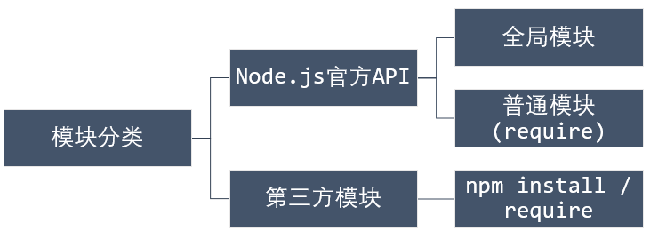
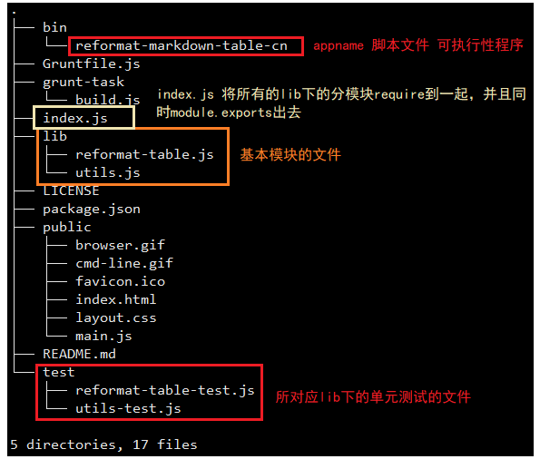
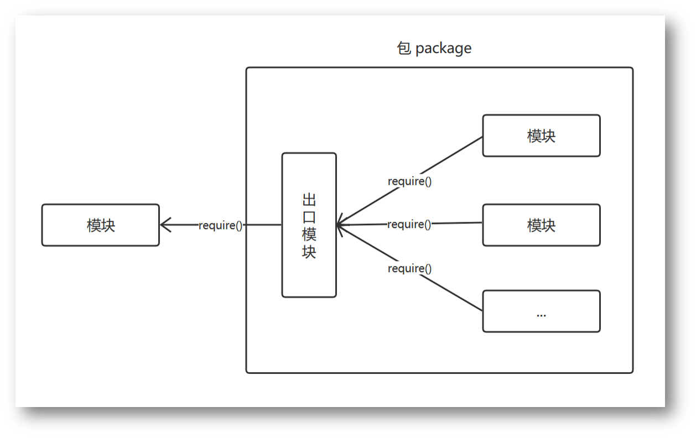

#### 全局：模块管理

Node应用是由模块组成的，Node遵循了CommonJS的模块规范，来隔离每个模块的作用域，使每个模块在它自身的命名空间中执行。

JS 模块化的两种方案分别是：`AMD` 和 `CommonJS` 

+ `AMD` 规范的主要内容：`AMD`是异步模块加载机制。从它的规范描述页面看，AMD很短也很简单，但它却完整描述了模块的定义，依赖关系，引用关系以及加载机制。**define和require这两个定义模块、调用模块的方法,合称为AMD模式**


+ `CommonJS`规范的主要内容：模块必须通过 module.exports 导出对外的变量或接口，通过 require() 来导入其他模块的输出到当前模块作用域中。



##### 使用第三方模块

- 导入 date-now 模块
- 调用 date-now 模块的 now 方法，在控制台打印 now 的运行结果
- 安装 date-now 模块，运行程序
- 创建 package.json 文件，用 npm install module-name -S 安装模块
- 查看 package.json 文件中的依赖项

```javascript
#!/usr/bin/node

var now = require('date-now');

console.log(now());
console.log(Date.now());

## 输出结果
1537882086300
1537882086304
```

在程序运行的时候，程序会报错，因为对于该程序，没有date-now这个模块，因此，需要先通过npm包管理器进行安装

```bash
#npm缩写于 Node Packaged Modules, 是 node.js 的模块管理器
~/node.js/nodejs-demo/07-module(master) » npm install date-now
```

> 关于在每一个包管理器中的package.json文件，这个文件是一个项目配置文件，里面有项目配置的一些信息，同时该文件还包括所需要的模块依赖项

使用 `package.json` 配置文件管理第三方模块的过程：

+ 首先我们创建一个文件夹package，在这个文件夹里面初识一个`package.json`文件

```bash
~/package » npm init
# 此时我们打开package.json文件
~/package » cat package.json                            wangding@OFFICE
{
  "name": "package",
  "version": "1.0.0",
  "description": "",
  "main": "index.js",
  "scripts": {
    "test": "echo \"Error: no test specified\" && exit 1"
  },
  "author": "",
  "license": "ISC",
  "dependencies": {
    "date-now": "^1.0.1"
  }
}
```

其中需要注意`"devDependencies"` 和`"dependencies"` ，其中前者是开发时以来的npm模块，后者是自己所写的打包成的应用程序所需要的npm模块

+ 安装第三方模块：`npm install moduleName -S(--save)` ，此时该模块会自动添加到`package.json`文件里的`"dependencies"` 里面
+ 发布程序和 package.json 配置文件（发布到npm网站上），然后使用时：运行 npm install 安装第三方模块就可以使用自己的创建的第三方模块了

如果我们使用的是别人的npm的包管理器的时候，只需要在别人的项目下运行npm install命令，就可以让程序自动下载程序运行时所需要的所有模块

##### 创建并使用模块，导出变量

- 在 02-export-var.js 脚本中导出变量 Math.PI打印 module 信息
- 在 02-main.js 脚本中导入上面的模块
- 测试模块的接口，观察 module 中的 exports 信息

```javascript
#!/usr/bin/node
// export-var.js
module.exports = Math.PI;

console.dir(module);// dir是输出一个对象
```

```javascript
#!/usr/bin/node

var PI = require('./02-export-var');

console.log('\n'+ PI);
console.log();
console.dir(module);
```

##### 创建并使用模块，导出函数

- 在 02-export-function.js 脚本中定义 circle 函数
- 函数的入口参数是圆的半径
- circle 函数返回一个对象
- 对象中有两个成员函数，分别计算：圆的面积和周长
- 导出 circle 函数
- 在 02-main.js 脚本中导入上面的模块
- 测试模块的接口，观察 module 中的 exports 信息

```javascript
#!/usr/bin/node
// 02-export-function.js
function circle(radius){
  return {
    diameter:function(){return 2*radius;},
    circumference:function(){return 2*Math.PI*radius;},
    area:function(){return Math.PI*radius*radius;}
  };
}

module.exports = circle;
```

```javascript
var circle = require('./02-export-function');

const log = console.log;

log(circle(20).diameter());
log(circle(20).circumference());
log(circle(20).area());
```

##### 创建并使用模块，导出对象

- 在 02-export-object.js 脚本中定义 Circle 对象字面量
- Circle 对象有三个公开方法，分别计算圆的直径、面积和周长
- 导出 Circle 对象，打印 module 信息
- 在 02-main.js 脚本中导入上面的模块
- 测试模块的接口，观察 module 中的 exports 信息

```javascript
#!/usr/bin/node
// 02-export-object.js 
module.exports = {
  diameter: function(radius){return 2*radius;},
  circumference:function(radius){return 2*Math.PI*radius;},
  area:function(radius){return Math.PI*radius*radius;}
}
```

```javascript
var circle = require('./02-export-object');

const log = console.log;

log(circle.diameter(20));
log(circle.circumference(20));
log(circle.area(20));
```

##### 使用全局对象 global

- 在 03-global.js 定义模块级变量 pi, 函数 circle 以及对象字面量 objCircle
- 编写 03-main.js 脚本，导入 03-global.js 脚本
- 使用 03-global.js 脚本中的变量、函数和对象
- 运行 03-main.js，观察程序结果，理解程序出错的原因
- 修改 03-global.js 脚本，将变量、函数和对象定义为全局的
- 运行 03-main.js 脚本，观察程序结果，理解程序工作原因

```javascript
#!/usr/bin/node
// 03-global.js
global.pi = Math.PI;

global.circle = (radius)=>{
  return {
    circumference:function(){return 2*Math.PI*radius;},
    area:function(){return Math.PI*radius*radius;}
  }
}

global.circleobj = {
  circumference:function(radius){return 2*Math.PI.radius},
  area:function(radius){return Math.PI*radius*radius}
}
```

```javascript
#!/usr/bin/node
// 03-main.js
require('./03-global.js');
console.log(global.pi);
console.log(global.circle(20).circumference());
console.log(global.circleobj.area(20));
```

##### 使用模块级变量在对象间共享信息

- 编写 04-share.js 脚本，定义模块级变量 count，定义构造函数 Num
- Num 有两个公开方法：add 让 count 加一，getCount 得到 count 的值
- 导出构造函数 Num
- 编写 04-main.js 脚本，导入 Num 构造函数
- 用 Num 实例化 n1 和 n2 两个对象
- n1.add() 方法调用两次，控制台打印 n1.getCount() 和 n2.getCount()
- n2.add() 方法调用一次，控制台打印 n1.getCount() 和 n2.getCount()
- 运行 04-main.js 程序，观察程序运行结果，理解程序工作原理

```javascript
#!/usr/bin/node
// 04-share.js
var count = 0;
function Num(){
  this.add = ()=>{count++;}
  this.getcount = ()=>{console.log(count);};
}

module.exports = Num;
```

```javascript
#!/usr/bin/node
// 04-main.js
var Num = require('./04-share.js');
var n1 = new Num();
var n2 = new Num();

n1.add();
n1.add();
n1.getcount();
n2.getcount();
n2.add();
n1.getcount();
n2.getcount();
## 输出结果
2
2
3
3
```

##### npm模块的目录结构和程序结构





