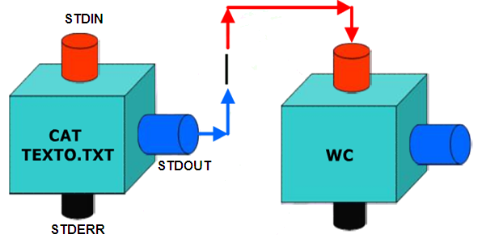
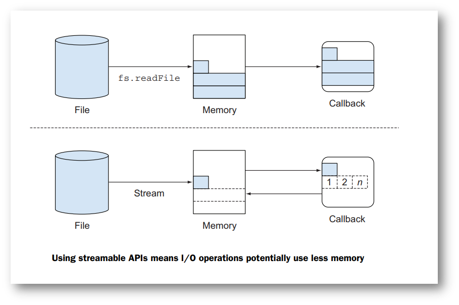
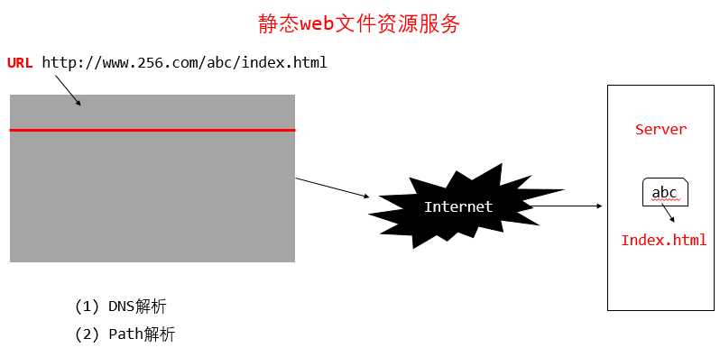
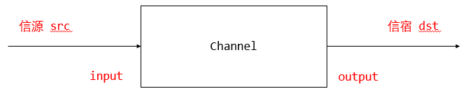
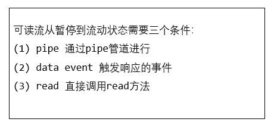
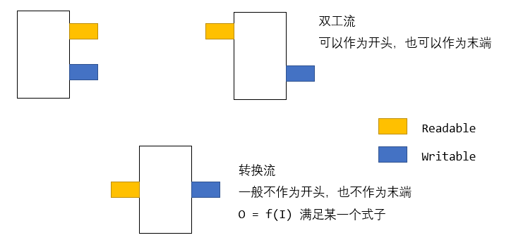

#### 流的概念



流是一种抽象的数据结构。想象水流，当在水管中流动时，就可以从某个地方（例如自来水厂）源源不断地到达另一个地方（比如你家的洗手池）。

- **标准输入流**：敲键盘的时候，就可以把每个字符依次连起来，看成字符流。这个流是从键盘输入到应用程序，这就是标准输入流（stdin）。

- **标准输出流：**如果应用程序把字符一个一个输出到显示器上，这就是标准输出流（stdout）。


Linux中流的体现（**流实质上就是管道**）

```bash
# 确定行数
~/node.js/nodejs-demo/06-buffer(master) » cat 01-basic.js | wc -l
40
# 确定当前目录下所有js文件的行数 （除去空格）
~/node.js/nodejs-demo/06-buffer(master) » cat *.js | grep -v ^$ | wc -l
106
# 统计nodejs-demo下的所有js文件的行数 （除去空格）
~/node.js/nodejs-demo(master) » find . -name "*.js" | xargs cat | grep -v ^$ | wc -l
663
```

#### 为什么需要流？

在node中读取文件的方式有来两种，一个是利用**fs模块**，一个是**利用流**来读取。如果读取小文件，我们可以使用fs读取，fs读取文件的时候，是将文件一次性读取到本地内存。而如果读取一个大文件，一次性读取会占用大量内存，效率很低，这个时候需要用流来读取。流是将数据分割段，一段一段的读取，效率很高。



#### 操作标准输入/输出流

- 通过 `data` 事件消费标准输入流中的数据
- 消费标准输入流中的数据，就是将标准输入流的数据写到标准输出流中
- 通过 `pipe` 方法将标准输入流接到标准输出流上，消费标准输入流中的数据
- 用交互式的方式运行程序
- 用流的方式运行程序（命令如下），观察程序运行的结果
- `cat 01-upper-case.js | ./01-upper-case.js`
- 思考两种程序运行方式的差异以及背后的原理

```javascript
#!/usr/bin/node

process.stdin.resume();
process.stdin.setEncoding('utf-8');

process.stdin.on('data',(data)=>{
  process.stdout.write(data.toUpperCase());
});
/*
global.setTimeout(()=>{
  stdin.removeAllListeners();
},3000)
*/
process.stdin.on('end',()=>{
  process.exit();
})

## 运行结果
> ./01-std-io.js
wd
WD
> cat 01-std-io.js | ./01-std-io.js
(会将该文件的所有内容大写)
> (echo 'wangding';sleep 2;echo 'hello') | ./01-std-io.js
WANGDING -- 会间隔2s
HELLO
```

#### Web 静态文件服务



##### 基于res.end的静态服务文件

- web 服务器根路径是当面脚本所在目录
- web 服务监听 8080 端口
- 正确响应浏览器发送的 URL 请求
- 当 URL 地址中的资源文件不存在时，提示用户文件不存在的错误信息

```javascript
#!/usr/bin/node

const http = require('http'),
      path = require('path'),
      fs = require('fs');

http.createServer((req,res)=>{
  // console.log(req);
  // console.log(req.headers); 显示头
  // console.log(req.url); 显示请求的url地址
  var file = path.join(__dirname,req.url);
  try{
  	res.end(fs.readFileSync(file).toString('utf-8'));
  }catch(err){
  	res.end(err.message);
  }
}).listen(8080);
```

##### 基于流的 Web 静态文件服务

```javascript
#!/usr/bin/node

const http = require('http'),
      path = require('path'),
      fs = require('fs');

http.createServer((req,res)=>{
  var file = path.join(__dirname,req.url);
  fs.readFileSync(file).pipe(res);// 对于流来说 是异步的 是不能使用try catch的
})
```

#### 流的分类

- Readable Stream :可读数据流
- Writeable Stream ：可写数据流
- Duplex Stream ：双向数据流，可以同时读和写
- Transform Stream： 转换数据流，可读可写，同时可以转换（处理）数据



##### 可读流

可读流有两种模式：flowing和paused

- 在流动模式下，可读流自动从系统底层读取数据，并通过EventEmitter接口的事件尽快将数据提供给应用。
- 在暂停模式下，必须显示调用stream.read()方法来从流中读取数据片段。



##### 可读推送流

- 实例化 Readable 流
- 向流中 push 若干个字符串
- 将 Readable 流管道连接到标准输出流
- 运行程序，观察程序的运行效果

```javascript
#!/usr/bin/node

const Readable = require('stream').Readable;

var src = new Readable();

src.push('Hello');
src.push('World');
src.push(null); // 代表推送结束

src.pipe(process.stdout);
```

##### 可读拉取流

- 实例化 Readable 流
- 实现流的 `_read` 方法
- `_read` 方法中循环 push [a-z] 26 个字母
- 将流接入到标准输出流
- 运行程序，观察程序的运行效果

```javascript
#!/usr/bin/node

const Readable = require('stream').Readable;

var src = new Readable();
var c = 97;

src._read = function(){
  src.push(String.fromCharCode(c++));
  // String.fromCharCode(72,69,76,76,79); HELLO
  // fromCharCode() 可接受一个指定的 Unicode 值，然后返回一个字符串。
  if(c > 'z'.charCodeAt(0)) src.push(null);
}

src.pipe(process.stdout);
// 对于push 和 pull 的主要区别在于时机的不同 一个是直接进行 一个是在pipe过程中进行
// pipe过程中会自动调用_read事件 不断监听 每次push一回 就会显示一次 知道结束push
```

##### 自定义可读流

- 定义 MyReadable 类继承 Readable 类
- 实例化 MyReadable 类
- 将 MyReadable 类的实例化对象接入到标准输出流上
- 运行程序，观察程序的运行效果

```javascript
#!/usr/bin/node

const Readable = require('stream').Readable,
      util = require('util');

var c = 97;

function MyReadable(){
  Readable.call(this);
}

MyReadable.prototype._read = function(){
  this.push(String.fromCharCode(c++));
  if(c > 'z'.charCodeAt(0)) this.push(null);
}

util.inherts(MyrReadable,Readable);

var src = new MyReadable();
src.pipe(process.stdout);
```

##### 自定义可写流

- 定义 GreenStream 类继承 Writable 类
- GreenStream 类将收到的数据输出到标准输出流中
- 输出的文本信息格式化成绿色，参考下面代码：
- `console.log('\033[1;32m' + 'hello world!' + '\033[1;37m');`
- 实例化 GreenStream 类，将标准输入流连接到自己定义的可写流对象上
- 运行程序，观察程序的运行效果

```javascript
#!/usr/bin/node

const Writable = require('stream').Writable,
      until = require('util');

function GreenStream(){
  Writable.call(this);
}

GreenStream.prototype._write = function(chunk,encode,cb){
  process.stdout.write(\033[1;32m' + chunk.slice(0,chunk.length-1) + '\033[1;37m'');
  cb;
}

util.inherts(GreenStream,Writable);
var src = new GreenStream();
process.stdin.pipe(src);
```

##### 双工流 vs 转换流

`Readable + Writable`



