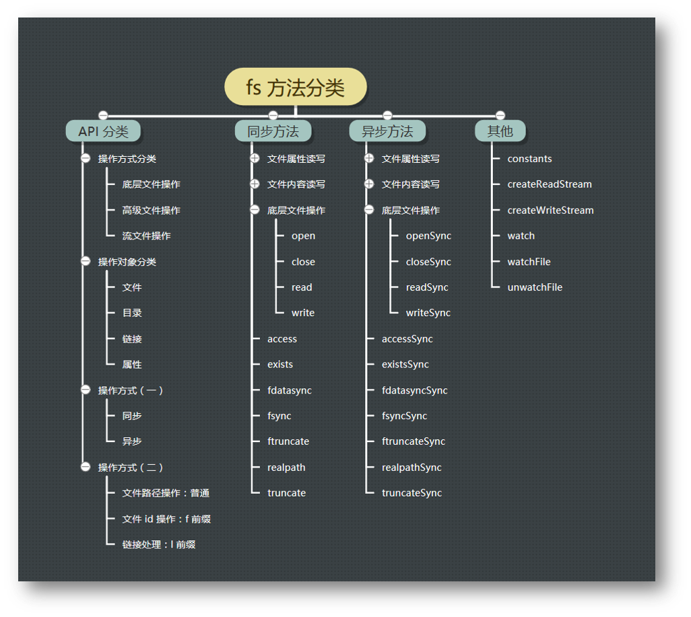
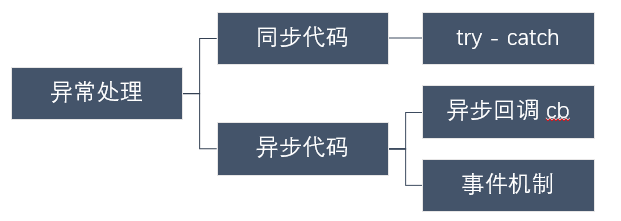
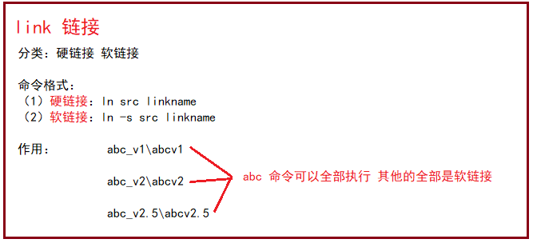
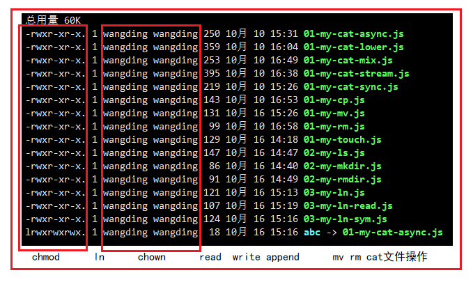

#### Node.js 文件系统简介

在软件工程的定义里面：`Software = program + document` （其中`document`分为内部文档和外部文档）

其中程序又可以分为数据结构和算法，数据结构的主要体现是在一个程序设计时，而在我们运行和编码一个程序的时候，我们需要运用数据（其中数据分为内部数据和外部数据），在数据中外部文件就是我们所说的**文件** `fs`

##### fs方法分类

+ 从操作方式上进行分类：底层文件操作、高级文件操作、流文件操作

+ 从操作对象上进行分类：文件、目录、链接、属性

+ 从操作的方式上进行分类：同步（同步的方法一般加上sync）和异步

  **说明：**当文件比较大的时候，一般会用异步的方式（流）进行操作，当文件比较小的时候，会用同步的方式进行**建议大家使用异步方法，比起同步，异步方法性能更高，速度更快，而且没有阻塞。**



#### 异常处理

我们常见的异常大致分为：语法错误、逻辑错误、运行时错误

对待异常处理要有全局意识，避免未知性的错误



```javascript
/*
1. 同步代码
try{
  console.log(fs.readFileSync(file).toString('utf-8'));
}catch(err){
  console.log(err.message,err.name);
  process.exit(-1);
}
2. 异步处理
fs.readFile(file,(err,data)=>{
  if(err) {
    console.log('Sorry,Something Woring!');
    process.exit(100);
  }else{
    console.log(data.toString('utf-8'));
  }
})
3. 事件机制
src.on('error',(err)=>{
  console.log(err.message);
  process.exit(1);
})
*/
```

#### fs--文件操作

##### 异步的打印文件内容

- 要求支持命令行参数，包括：要打印的文件名
- 没有命令行参数时，默认打印脚本本身内容
- 文件不存在则打印错误信息
- 文件存在则在控制台打印文件内容
- 用异步方式读取文件内容

```javascript
#!/usr/bin/node

const fs = require('fs');

var file = process.argv[2] || __filename;

fs.readFile(file,(err,data)=>{
  if(err){
  	console.log(err.message);
    process.exit(1);
  }else{
  	console.log(data.toString('utf-8'));
  }
})
```

##### 底层的打印文件内容

- 要求支持命令行参数，包括：要打印的文件名
- 没有命令行参数时，默认打印脚本本身内容
- 文件不存在则打印错误信息
- 文件存在则在控制台打印文件内容
- 用底层 API 打开文件，再同步读取文件内容

```javascript
#!/usr/bin/node

const fs = require('fs');
var file = process.argv[2] || __filename;

var fid = fs.openSync(file,'r');

var len = fs.statSync(file).size;
var buf = new Buffer(len);
fs.readSync(fid,buf,0,len);
console.log(buf.toString('utf-8'));

fs.closeSync(fid)
/*
打开文件的操作：
fs.open(path, flags[, mode], callback)
fs.openSync(path, flags[, mode]) // 异常处理需要使用try catch
flags 可以是：
r读 w写 a追加
'r' - 以读取模式打开文件。如果文件不存在则发生异常。
'r+' - 以读写模式打开文件。如果文件不存在则发生异常。
'rs+' - 以同步读写模式打开文件。命令操作系统绕过本地文件系统缓存。
mode 可设置文件模式（权限和 sticky 位），但只有当文件被创建时才有效。默认为 0o666，可读写。

获取文件信息操作：
fs.stat(path, callback)  获取文件信息 path - 文件路径。callback - 回调函数，带有两个参数如：(err, stats), stats 是 fs.Stats 对象

返回读取字节的数量：
fs.readSync(fd, buffer, offset, length, position) 返回读取字节的数量

关闭文件的操作：
fs.close(fd, callback)：callback <Function>：err <Error>异步的 close(2)。 完成回调只有一个可能的异常参数。
*/
```

##### 同步的打印文件内容

- 要求支持命令行参数，包括：要打印的文件名
- 没有命令行参数时，默认打印脚本本身内容
- 文件不存在则打印错误信息
- 文件存在则在控制台打印文件内容
- 用同步的方式读取文件内容并将文件内容输出到控制台上

```javascript
#!/usr/bin/node

const fs = require('fs');
var file = process.argv[2] || __filename;

try{
  console.log(fs.readFileSync(file).toString('utf-8'));
}catch(err){
  console.log(err.message);
  process.exit(1);
}
/*fs.readFileSync(path[, options])
如果指定了 encoding 选项，则该函数返回一个字符串，否则返回一个 buffer。*/
```

##### 流的打印文件内容

- 要求支持命令行参数，包括：要打印的文件名
- 没有命令行参数时，默认打印脚本本身内容
- 文件不存在则打印错误信息
- 文件存在则在控制台打印文件内容
- 用流的方式读取文件内容并将管道接入到标准输出流上

```javascript
#!/usr/bin/node

const fs = require('fs');
var file = process.argv[2] || __filename;

var readStream = fs.createReadStream(file);
readStream.on('error',(err)=>{console.log(err.message);process.exit(-1);});
readStream.on('open',function(){this.pipe(process.stdout)});
// 处理错误异常要有全局意识
fs.createReadStream(file).pipe(process.stdout);

process.on('uncaughtException',(err)=>{
  console.log(err.message);
  process.exit(1);
})

/*
fs.createReadStreame()这个api的作用是打开一个可读的文件流并且返回一个fs.ReadStream对象
let readStream=fs.createReadStream('./test/b.js',{encoding:'utf8'});
//console.log(readStream);

//读取文件发生错误事件
readStream.on('error', (err) => {
    console.log('发生异常:', err);
});
//已打开要读取的文件事件
readStream.on('open', (fd) => {
    console.log('文件已打开:', fd);
});
//文件已经就位，可用于读取事件
readStream.on('ready', () => {
    console.log('文件已准备好..');
});
 
//文件读取中事件·····
readStream.on('data', (chunk) => {
    console.log('读取文件数据:', chunk);
});
 
//文件读取完成事件
readStream.on('end', () => {
    console.log('读取已完成..');
});
 
//文件已关闭事件
readStream.on('close', () => {
    console.log('文件已关闭！');
});
*/
```

##### 混合的打印文件内容

- 要求支持命令行参数，包括：要打印的文件名
- 没有命令行参数时，默认打印脚本本身内容
- 文件不存在则打印错误信息
- 文件存在则在控制台打印文件内容
- 用底层 API 打开文件，再同步读取文件内容
- 用 writeSync 向控制台输出文件内容

```javascript
#!/usr/bin/node

const fs = require('fs');
var file = process.arv[2] || __filename;

var fd = fs.openSync(file,'r');

fs.writeSync(1,fs.readFileSync(file).toString('utf-8'));
fs.closeSync(fd);
```

##### 复制文件

- 要求支持命令行参数，包括：要复制的源文件名和目标文件名
- 源文件不存在则打印错误信息
- 除了能复制文件内容，还需要复制文件权限（未实现）

```javascript
#!/usr/bin/node

const fs = require('fs');

var src = process.argv[2],
    dst = process.argv[3];

fs.writeFileSync(dst,fs.readFileSync(src));
```

##### 移动文件

- 要求支持命令行参数，包括：要移动的源文件名和目标文件名
- 源文件不存在则打印错误信息
- 除了能移动文件，可以修改文件名

```javascript
#!/usr/bin/node

const fs = require('fs');

var src = process.argv[2],
    dst = process.argv[3];

fs.renameSync(src,dst);// 移动的过程中可以进行重命名
```

##### 删除文件

- 要求支持命令行参数，包括：要删除的文件名
- 文件不存在打印错误信息
- 文件存在则删除
- 如果命令行参数指定的是一个目录，则忽略他

```javascript
#!/usr/bin/node

const fs = require('fs');

var file = process.argv[2];

fs.unlinkSync(file);// rm == unlike
```

##### 创建空文件

- 要求支持命令行参数，包括：要创建的文件名
- 创建指定名称的文件
- 文件的长度为 0 字节

```javascript
#!/usr/bin/node

const fs = require('fs');

var file = process.argv[2];

fs.appendFileSync(file);// 或者通过fs.writeFileSync(file,'');
```

#### fs-- 目录操作

##### 查看目录内容

- 要求支持命令行参数，包括：要查看的目录名
- 命令行参数不存在的情况下，默认查看当前脚本所在目录
- 命令行参数指定的目录不存在的情况下，打印错误信息
- 在控制台打印指定目录下的内容

```javascript
#!/usr/bin/node

const fs = require('fs');

var dir = process.argv[2];

console.log(fs.readdirSync(dir));// 返回的是一个数组信息
```

##### 创建目录

- 要求支持命令行参数，包括：要创建的目录名
- 命令行参数不存在的情况下，打印错误信息
- 在当前目录创建指定名称的文件夹

```javascript
#!/usr/bin/node

const fs = require('fs');
var dir = process.argv[2];

fs.mkdirSync(dir);
```

##### 删除目录

- 要求支持命令行参数，包括：要删除的目录名
- 命令行参数不存在的情况下，打印错误信息
- 删除指定名称的文件夹
- 如果命令行参数是一个文件名，则忽略他

```javascript
#!/usr/bin/node

const fs = require('fs');
var dir = process.argv[2];

fs.rmdirSync(dir);
```

#### fs--链接操作



##### 创建链接

- 要求支持命令行参数，包括：源文件和链接文件或者 -s 选项
- -s 选项说明创建的是符号链接
- 没有 -s 选项说明创建的是硬链接
- 命令行参数不正确时，提示相应的错误信息
- 可以创建硬链接也可以创建符号链接

```javascript
#!/usr/bin/node

const fs = require('fs');

var src = process.argv[2],
    lnk = process.argv[3];
// 硬链接
fs.linkSync(src,lnk);

// 软链接
fs.symlinkSync(src,lnk);
```

##### 打印链接

- 要求支持命令行参数，包括：链接文件名
- 命令行参数不存在的情况下，打印错误信息
- 命令行参数指定的文件名不存在时，打印错误信息
- 正常情况下打印符号链接所链接的文件

```javascript
#!/usr/bin/node

const fs = require('fs');

var lnk = process.argv[2];

console.log(fs.readlinkSync(lnk));
```

#### fs-- 属性操作



##### 修改文件权限

- 要求支持命令行参数，包括：权限模式和文件名
- 命令行参数不存在的情况下，打印错误信息
- 命令行参数指定的文件名不存在时或者其他参数不正确时，打印相应的错误信息
- 正常情况下修改指定文件的权限

```javascript
#!/usr/bin/node

const fs = require('fs');

var file = process.argv[2],
    mode = process.argv[3];
fs.chmodSync(file,mode);
```

##### 修改文件所有者

- 要求支持命令行参数，包括：用户 ID，组 ID 和文件名
- 命令行参数不存在的情况下，打印错误信息
- 命令行参数指定的文件名不存在时或者其他参数不正确时，打印相应的错误信息
- 正常情况下修改指定文件的所属用户和所属组

```javascript
#!/usr/bin/node

const fs = require('fs');

var file = process.argv[2],
    uid = process.argv[3],
    gid = process.argv[4];
fs.chownSync(file,Number(uid),Number(gid));
```

##### 文件信息统计

- 要求支持命令行参数，包括：要统计信息的文件名
- 命令行参数不存在的情况下，默认统计当前脚本文件的信息
- 命令行参数指定的文件名不存在时，打印错误信息
- 正常情况下统计命令行参数指定文件的统计信息

```javascript
#!/usr/bin/node

const fs = require('fs');

var file = process.argv[2];
console.log(fs.statSync(file));// 返回的是一个对象
```

#### 监视文件变化

- 监视脚本所在目录下文件的变化
- 把目录下文件的变化输出到控制台

```javascript
#!/usr/bin/node

const fs = require('fs');
fs.watch(__filename,(e,r)=>{
  console.log(e,r);
})
```

#### 综合案例：递归删除

- 要求支持命令行参数，包括：要删除的目录名或文件名
- 命令行参数不存在的情况下，打印错误信息
- 命令行参数指定的文件名或者目录名不存在时，打印错误信息
- 如果命令行参数是合法的文件名，则删除文件
- 如果命令行参数是合法的目录名，则删除该目录以及该目录下的所有文件以及子目录

```javascript
#!/usr/bin/node

const fs = require('fs'),
      path = require('path');
var file = process.argv[2];
if(fs.statSync(file).isFile()) fs.unlikeSync(file);
if(fs.statSync(file).isDirectory()) deletedir(file);

function deletedir(file){
  var files = fs.readdirSync(file);
  for(var i= 0;i<files.length;i++){
  	var floder = path.join(file,files[i]);
    if(fs.statSync(floder).isFile()){
  		fs.unlikeSync(floder);
      	continue;
	}
    if(fs.statSync(floder).isDirectory()) deletedir(file);
  }
  fs.rmdirSync(file);
}
```