#### 调试：除掉程序中的bug

> 程序能一次写完并正常运行的概率很小，基本不超过1%。总会有各种各样的bug需要修正。有的bug很简单，看看错误信息就知道，有的bug很复杂，我们需要知道出错时，哪些变量的值是正确的，哪些变量的值是错误的，因此，需要一整套调试程序的手段来修复bug。

调试的意思是调整代码，测试代码。调试主要通过两个步骤来进行：定位、修复

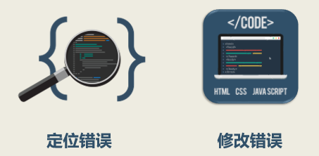

在程序中，错误的类型主要包括三种：语法错误、逻辑错误、运行时错误

调试的手段主要有四种：

+ 交互式调试：运行过程中通过加断点进行调试（如果程序是循环出错时，可以通过高级的IDE添加条件断点） **控制程序的执行，从而查看对应的变量环境**


+ 打印调试：对于类似于JavaScript的异步编程语言，不能使用交互式调试，此时需要用到`console.log()`
+ 远程调试

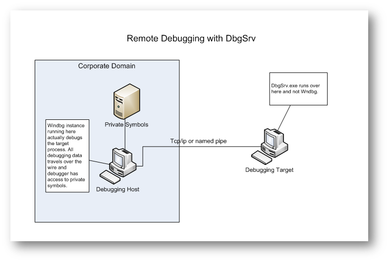

+ 事后调试

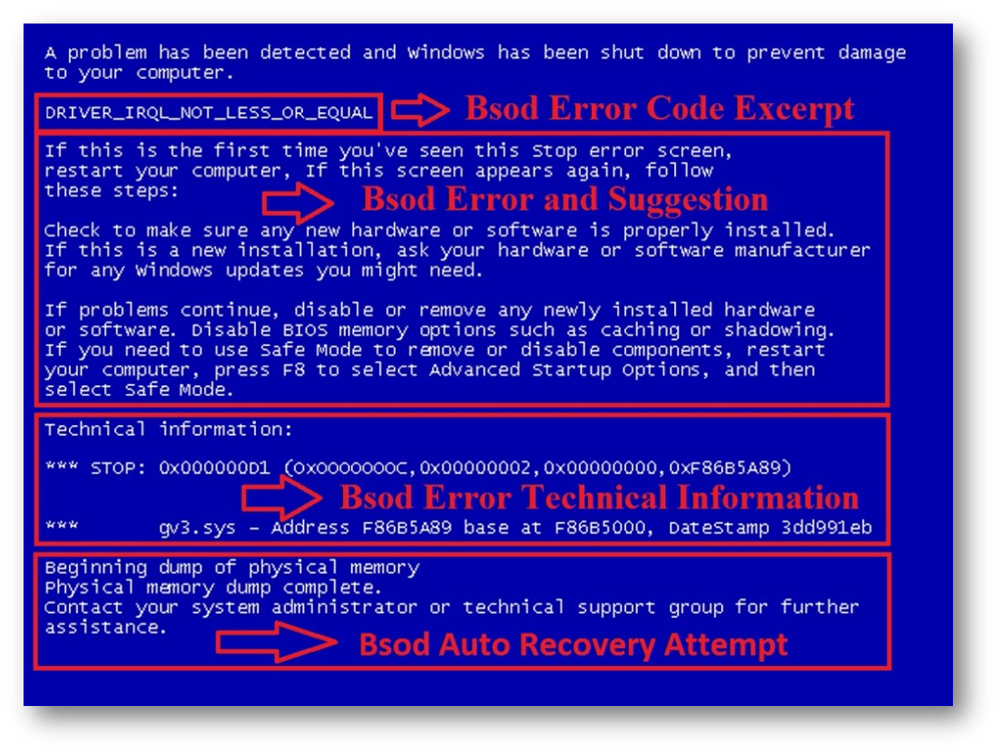

#### 静态代码检查

**[eslint](https://cn.eslint.org/)**：可组装的JavaScript和JSX检查工具，它主要检查语法错误以及对应的代码规范

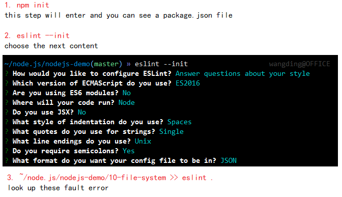

- 在 nodejs-demo 目录下初始化 ESLint 配置文件
- 如果不希望 ESLint 检查某些文件夹或文件，则配置 .eslintignore 文件
- 用 ESLint 工具检查自己写过的所有代码
- 如果规则定义合理，则改正代码中问题
- 如果规则定义的不合理，则修改规则设置

```json
# .eslintrc.json
{
    "env": {
        "es6": true,
        "node": true
    },
    "extends": "eslint:recommended",
    "parserOptions": {
        "ecmaVersion": 2015
    },
    "rules": {
        "indent": [
            "error",
            2,
            {
              "SwitchCase":1,
              "VariableDeclarator":{"var":2,"let":2,"const":3}
            }
        ],
        "linebreak-style": [
            "error",
            "unix"
        ],
        "quotes": [
            "error",
            "single"
        ],
        "semi": [
            "error",
            "always"
        ],
        "no-console":["off"]
    }
}
```

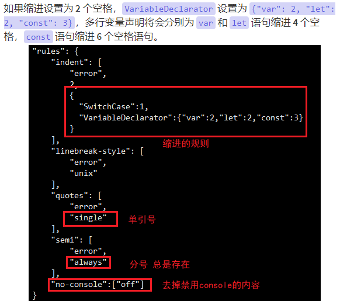

```json
# .eslintignore

node_modules
LICENSE
*.md
*.json
```

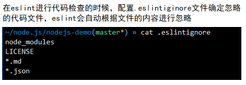

如何实现vim和eslint的连接？

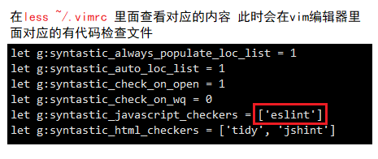

#### 打印调试

- 复制 09-stream/02-static-web-server.js 到 11-debug 目录下，修改文件名为 01-static-web-server.js
- 修改代码，添加打印调试或者屏蔽打印调试
- 运行程序，观察打印调试信息是否正常显示
- 修改代码，支持对 NODE_DEBUG 环境变量的打印调试支持
- 运行程序，观察打印调试信息是否正常显示
- 添加 NODE_DEBUG 环境变量
- 运行程序，观察打印调试信息是否正常显示

```javascript
#!/usr/bin/node

const http = require('http'),
      path = require('path'),
      fs = require('fs'),
      //util = require('util'),
      //log = util.debuglog('app');
      // 处理代码文件中的打印调试语句，如果加入这两行语句 在运行过程中打印调试代码将不出现
      log = console.log;
      
var file;

http.createServer((req,res)=>{
  log(req.headers);
  log();
  log(req.url);
  file = path.join(__dirname,req.url);
  log();
  log(file);

  var read = fs.createReadStream(file);// 由于流是异步的不能使用try catch
  read.on('error',(err)=>{
    res.end(err.message);
    return;
  });
  read.pipe(res);
}).listen(8080);
```

```bash
## 代码运行结果 后台界面
~/node.js/nodejs-demo/11-debug(master*) » ./01-static-web-server.js
{ 'user-agent': 'curl/7.29.0',
  host: 'localhost:8080',
  accept: '*/*' }
/
/home/wangding/node.js/nodejs-demo/11-debug/

{ 'user-agent': 'curl/7.29.0',
  host: 'localhost:8080',
  accept: '*/*' }
/01-static-web-server.js
/home/wangding/node.js/nodejs-demo/11-debug/01-static-web-server.js
```

```bash
## 代码运行结果 前台界面
~ » curl http://localhost:8080/                                  wangding@OFFICE
EISDIR: illegal operation on a directory, read%                                  
------------------------------------------------------------
~ » curl http://localhost:8080/01-static-web-server.js           wangding@OFFICE
#!/usr/bin/node
...代码文件
```

##### 打印调试中的调试代码处理

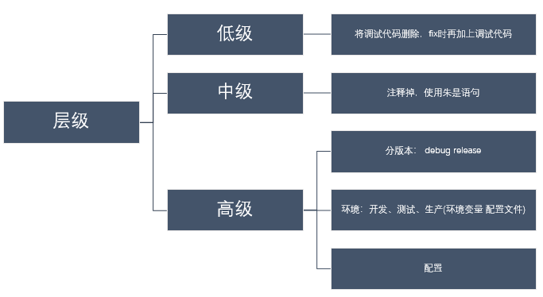

重点介绍两种环境变量的给法：（即实现如何让上述的打印调试的代码展现出来）

+ 通过`export NODE_DEBUG` 设置环境变量
+ 通过命令行 `NODE_DEBUG=app node 01-static-web-server.js`

```bash
# method1
~/node.js/nodejs-demo/11-debug(master*) »  NODE_DEBUG=app node 01-static-web-server.js
APP 3287: { 'user-agent': 'curl/7.29.0',
  host: 'localhost:8080',
  accept: '*/*' }
APP 3287: 
APP 3287: /01-static-web-server.js
APP 3287: 
APP 3287: /home/wangding/node.js/nodejs-demo/11-debug/01-static-web-server.js

# method2
~/node.js/nodejs-demo/11-debug(master*) » export NODE_DEBUG=app
~/node.js/nodejs-demo/11-debug(master*) » ./01-static-web-server.js
APP 3330: { 'user-agent': 'curl/7.29.0',
  host: 'localhost:8080',
  accept: '*/*' }
APP 3330: 
APP 3330: /01-static-web-server.js
APP 3330: 
APP 3330: /home/wangding/node.js/nodejs-demo/11-debug/01-static-web-server.js
## 设置环境变量 export NODE_DEBUG
## 取消环境变量 unset NODE_DEBUG
```

#### Node.js 命令行调试器

通过使用`node inspect 02-play-dog.js`进行命令行界面的调试

```bash
~/node.js/nodejs-demo/11-debug(master*) » node inspect 02-play-dog.js
< Debugger listening on ws://127.0.0.1:9229/4afe3947-f3a3-4fab-880e-374c3791ff30
< For help, see: https://nodejs.org/en/docs/inspector
< Debugger attached.
Break on start in file:///home/wangding/node.js/nodejs-demo/11-debug/02-play-dog.js:1
> 1 (function (exports, require, module, __filename, __dirname) { 
  2 
  3 var Dog = require('./02-dog.js');
debug> ...
```

`node inspect`的参考手册

```txt
debug> help
run, restart, r       Run the application or reconnect
kill                  Kill a running application or disconnect

cont, c               Resume execution 继续运行 到断点会停止
next, n               Continue to next line in current file
step, s               Step into, potentially entering a function
out, o                Step out, leaving the current function
backtrace, bt         Print the current backtrace
list                  Print the source around the current line where execution
                      is currently paused

setBreakpoint, sb     Set a breakpoint 设置断点
clearBreakpoint, cb   Clear a breakpoint
breakpoints           List all known breakpoints
breakOnException      Pause execution whenever an exception is thrown
breakOnUncaught       Pause execution whenever an exception isn't caught
breakOnNone           Don't pause on exceptions (this is the default)

watch(expr)           Start watching the given expression 查看变量
unwatch(expr)         Stop watching an expression
watchers              Print all watched expressions and their current values

exec(expr)            Evaluate the expression and print the value
repl                  Enter a debug repl that works like exec 直接输出变量值

scripts               List application scripts that are currently loaded
scripts(true)         List all scripts (including node-internals)

profile               Start CPU profiling session.
profileEnd            Stop current CPU profiling session.
profiles              Array of completed CPU profiling sessions.
profiles[n].save(filepath = 'node.cpuprofile')
                      Save CPU profiling session to disk as JSON.

takeHeapSnapshot(filepath = 'node.heapsnapshot')
                      Take a heap snapshot and save to disk as JSON.
```

**调试步骤过程：**

```bash
debug> list(20) # 显示20行
debug> n # 单步执行
debug> s # 跳入函数内部执行
debug> repl # 查看变量
Press Ctrl + C to leave debug repl
> name
'taidi'
> energy
5
debug> watch(this) # 监视变量
debug> n
break in file:///home/wangding/node.js/nodejs-demo/11-debug/02-dog.js:7
Watchers:
  0: [object Object] = '<Converting circular structure to JSON>'

  5 function Dog(name,energy){
  6   var _name = name;
> 7   var _energy = energy;
  8   var that = this;
  9   this.name = ()=> _name;
debug> unwatch(this) # 撤销监视变量
debug> n
break in file:///home/wangding/node.js/nodejs-demo/11-debug/02-dog.js:8
  6   var _name = name;
  7   var _energy = energy;
> 8   var that = this;
  9   this.name = ()=> _name;
 10   this.energy = () => _energy;
debug> sb(12)
```

#### Chrome 图形界面调试器

- 使用 Chrome 图形界面调试器，调试程序，去掉程序中的 bug

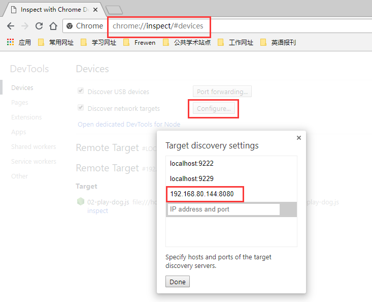

```bash
~/node.js/nodejs-demo/11-debug(master*) » node --inspect-brk=192.168.80.144:8080 02-play-dog.js 
Debugger listening on ws://192.168.80.144:8080/3110265a-868c-442c-9d16-5fc777db1f17
For help, see: https://nodejs.org/en/docs/inspector
Debugger attached.
taidi 5
zangao 10
taidi 4
zangao 9
taidi 3
zangao 8
taidi 2
zangao 7
taidi 1
zangao 6
zangao 5
zangao 4
zangao 3
zangao 2
zangao 1
Waiting for the debugger to disconnect...
```

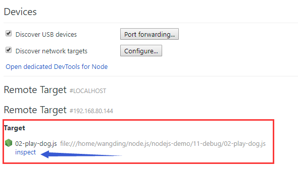

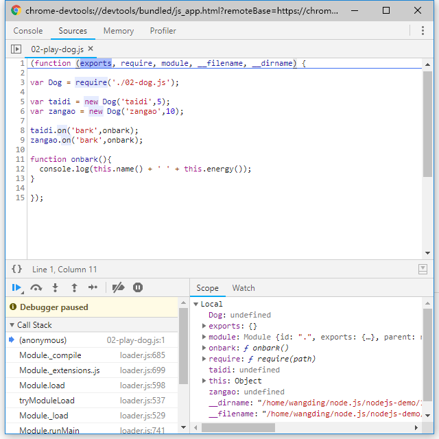