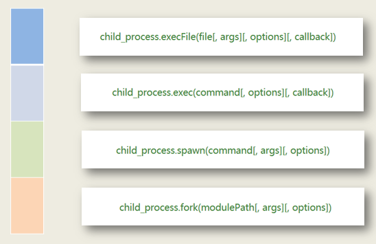
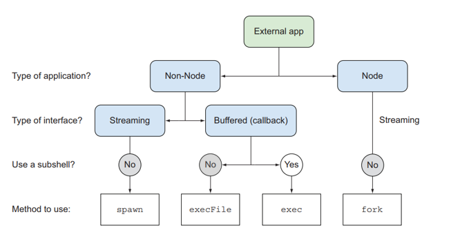
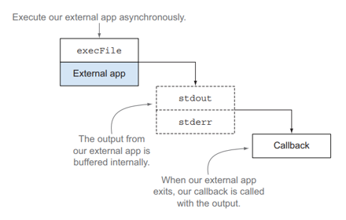
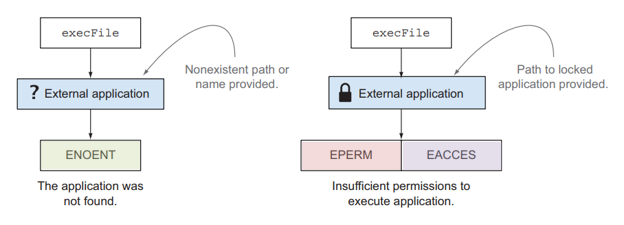
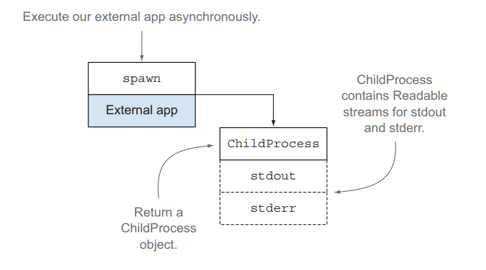
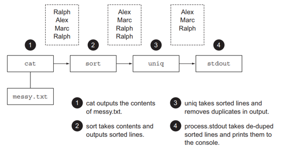
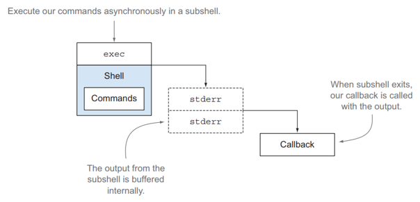
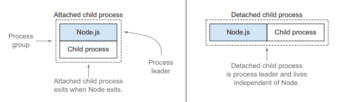
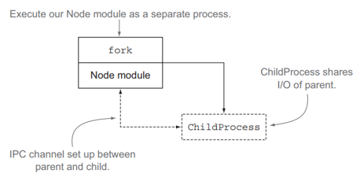

#### 子进程

子进程的主要功能就是实现如何在`node.js`中调用第三方程序的功能



四种方法的应用场景：



+ `type of application` 判断应用程序是否需要调用`node.js`脚本
+ `type of interface` 判断不需要调用`node.js`脚本的是流文件还是`buffer`文件，其中`buffer`文件是以整个文件为单位进行传输的，而流文件是以一个一个的小文件分别传输的
+ `type of subshell` 判断不需调用`node.js`脚本的`buffer`文件是否需要`shell`外壳

#### execFile



```txt
child_process.execFile(file,[,arg][,options][,callback])
// child_process.execFile('cat',['01-demo.js'],(err,out,error)=>{})
```

上述语句在写`cat` 的时候，所对应的是一个可执行文件，系统会从`path`环境变量里寻找`cat`的执行文件进行执行

##### execFile 方式调用外部程序

- 可以执行任何一个外部程序
- 命令行参数中有需要执行的外部程序以及外部程序的参数
- 外部程序运行的正确信息打印在控制台上，外部程序运行的错误信息打印在控制台上

```markdown
测试用例 1：执行 ./01-exec-file.js，预期结果：控制台打印 01-exec-file.js 文件内容
测试用例 2：执行 ./01-exec-file.js mkdir abc，预期结果：当前目录下创建 abc 文件夹
测试用例 3：执行 ./01-exec-file.js mkdir abc, 预期结果：报错，abc 文件夹已存在
测试用例 4：执行 ./01-exec-file.js ls -l / /usr /var，预期结果：长格式输出根目录、/usr 和 /var 三个目录的内容
测试用例 5：执行 ./01-exec-file.js abc，预期结果：报错，Error: spawn abc ENOENT
```

```javascript
#!/usr/bin/node

const cp = require('child_process'),
      cmd = process.argv[2];

var arg = [];
for(var i = 3;i<process.argv.length;i++){
  	arg.push(process.argv[i]);
}

cp.execFile(cmd,arg,(err,out,error)=>{
  	if(err){
  		console.log(err.message);
      	process.exit(100);
	}
  	console.log(out);
})
```

##### 错误类型



+ `ENOENT` ：该命令未找到，表示该命令不存在 `spawn def ENOENT`
+ `EPERM EACCES` ：表示命令的权限不够，必须`chown` 需要使用`sudo`权限

#### spawn



优势：

+ 速度响应快
+ 内存占用较少
+ 可以进行管道操作

```txt
child_process.spawn(command[,arg][,options])
// child_process.spawn('cat',['01-demo.js'])
```

##### spawn 方式调用外部程序

- 执行一个外部命令，例如：cat 打印 `02-spawn-v1.js` 脚本文件内容

```javascript
#!/usr/bin/node

const cp = require('child_process');

var cmd = cp.spwan('cat',['01-exec-file.js']);
// 返回的是一个childprocess对象

cmd.stdout.pipe(process.stdout);
```

##### 自定义的外部程序

- 打印当前进程 ID 信息
- 每 2 秒在控制台打印当前时间
- 16 秒后程序结束运行

```javascript
#!/usr/bin/node

const cp = require('child_process');
console.log('I am the child process.PID:',process.pid);

var timer = global.setInterval(()=>{
	console.log('time:',Date.now());
},1500);

global.setTimeout(()=>{
  	global.clearInterval(timer);
},150000)
```

##### execFile 调用自定义的外部程序

- 打印当前进程 ID 信息
- 调用任务 4 的外部程序
- 观察程序的运行结果

```javascript
#!/usr/bin/node

const cp = require('child_process');

cp.execFile('./02-child.js',(err,out)=>{// cp.execFile('node',['02-child.js'],(err,out)=>{
	if(err){
  		console.log(err.message);
      	process.exit(100);
	}
  	console.log(out);
})
```

##### spawn 调用自定义的外部程序

- 打印当前进程 ID 信息
- 调用任务 4 的外部程序，观察程序的运行结果
- 比较与任务 5 程序运行结果的差异
- 体会 execFile 和 spawn 方法的区别

```javascript
#!/usr/bin/node

const cp = require('child_process');

var cmd = cp.spawn('./02-child.js');// cp.spawn('node',['02-child.js']);

cmd.stdout.pipe(process.stdout);
```

##### HTTP 服务调用自定义的外部程序

- 创建 HTTP 服务
- 监听 8080 端口
- 接收到客户端请求后，执行任务 4 的外部程序
- 将任务 4 程序的运行结果，输出到 HTTP 客户端

```javascript
#!/usr/bin/node

const http = require('http'),
      cp = require('child_process');

http.createServer((req,res)=>{
  	var cmd = cp.spawn('node',['02-child.js']);
  cmd.stdout.pipe(res);
}).listen(8080);
```

##### 管道方式连接多个外部程序



- 创建一个 `messy.txt` 文本文件，内容如下：

  ```txt
  wangding
  louying
  wangchenxin
  wangding
  ```

- 用 spawn 方法通过管道执行：`cat`，`sort`，`uniq` 三个外部程序

- 最终得到有序的、除掉重复内容的信息

```javascript
#!/usr/bin/node

const cp = require('child_process');

var cat = cp.spawn('cat',['messy.txt']);
var sort = cp.spawn('sort');
var uniq = cp.spaw('uniq');

cat.stdout.pipe(sort.stdin);
sort.stdout.pipe(uniq.stdin);
uniq.stdout.pipe(process.stdout);
```

#### exec



```txt
child_process.exec(command[,options][,callback])
// child_process.exec('cat 01-demo.js',(err,out,error)=>{})
```

##### exec 方式调用外部程序

- 支持命令行参数，命令行参数描述要只执行的外部程序
- 执行命令行参数中描述的外部程序
- 将外部程序的运行结果打印到控制台

```javascript
#!/usr/bin/node

const cp = require('child_process');

cp.exec('cat messy.txt | sort | uniq',(err,out)=>{
  	if(err){
  		console.log(err.message);
      	process.exit(100);
	}
  	console.log(out);
})
```

#### 子进程分离



一般情况下，子程序会依托于主程序，如果在options参数里面设置了detached那么子程序会分离。

**任务要求：**

- 打印主进程 ID 信息
- 用 spawn 方法调用任务 4 的自定义外部程序
- 外部程序和主进程分离，主进程 5 秒后退出
- 子进程运行的结果输出到标准输出流中
- 观察主进程退出后，子进程是否还在运行

```javascript
#!/usr/bin/node

const cp = require('child_process');

console.log('I am the father process. PID:',process.pid);
var cmd = cp.spawn('node',['02-child.js'],{detached:true,stdio:['ignore',1,2]);

// cmd.stdout.pipe(process.stdout);
global.setTimeout(()=>{
    console.log('I am the father,goodbye!');
  	process.exit(100);
},6000)

/*
1. options.detached:true 子进程会和主进程进行分离 子进程会称为新的进程组和会话的领导者
2. options.stdio:
options.stdio 选项用于配置子进程与父进程之间建立的管道。 默认情况下，子进程的 stdin、 stdout 和 stderr 会重定向到 ChildProcess 对象上的 subprocess.stdin、 subprocess.stdout 和 subprocess.stderr 流。 这等同于将 options.stdio 设为 ['pipe', 'pipe', 'pipe']。

为了方便起见，options.stdio 可以是以下字符串之一：

- 'pipe' - 等同于 ['pipe', 'pipe', 'pipe'] （默认）
- 'ignore' - 等同于 ['ignore', 'ignore', 'ignore']
- 'inherit' - 等同于 [process.stdin, process.stdout, process.stderr] 或 [0,1,2]
*/
```
#### fork



优势：

+ 独立子程序 `node.js` 单线程、并行、异步
+ `IPC`内置 可以完成进程间的通信

```txt
child_process.fork(modulepath[,args][,options])
// child_process.fork('01-demo.js');
```

##### fork 方法调用外部程序

- 打印当前进程 ID 信息
- 用 fork 方法调用任务 4 自定义的外部程序
- 主进程 5 秒后退出
- 观察主进程退出后，子进程是否还在运行

```javascript
#!/usr/bin/node

const cp = require('child_process');

console.log('I am the father process. PID:',process.pid);

cp.fork('./02-child.js');

global.setTimeout(()=>{
  	console.log('I am the father,goodbye');
	process.exit(100);
},6000)
```

##### 进程间通信之子进程

- 打印当前进程 ID 信息
- 接收到父进程发送的消息后，将消息内容打印到控制台
- 向父进程发送消息

```javascript
#!/usr/bin/node

console.log('I am the child process. PID:',process.pid);

process.send('Child process is strated!' + process.pid);
process.on('message',(msg)=>{
  console.log('message from father:',msg);
})
```

##### 进程间通信之父进程

- 打印当前进程 ID 信息
- 用 fork 方法调用任务 12 编写的程序
- 2 秒后向外部程序发送进程间消息

```javascript
#!/usr/bin/node

const cp = require('child_process');

console.log('I am the father process. PID:',process.pid);
var cmd = cp.fork('./05-ipc-child.js');

global.setTimeout(()=>{
    cmd.send('I am the father.PID:',process.pid);
},3000);
cmd.on('message',(msg)=>{
  	console.log('child-msg:',msg);
});
```

#### 同步调用外部程序

- 用 spawn 的同步版本调用任务 4 编写的程序
- 观察同步调用外部程序的运行结果和异步调用的区别

```javascript
#!/usr/bin/node

const cp = require('child_process');

var cmd = cp.execFileSync('cat',['01-exec-file.js']);// 得到的是一个buffer文件

console.log(cmd.toString('utf-8'));
```