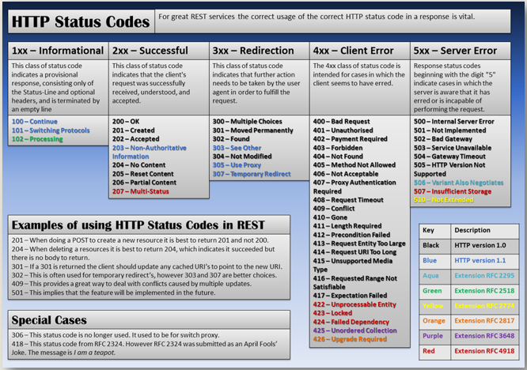
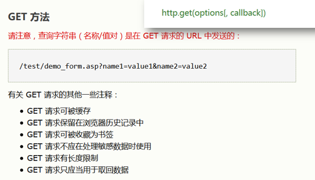
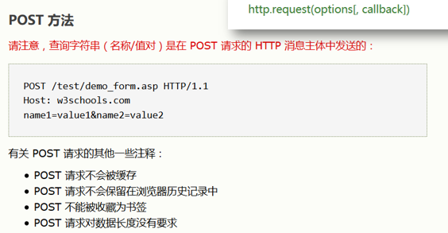
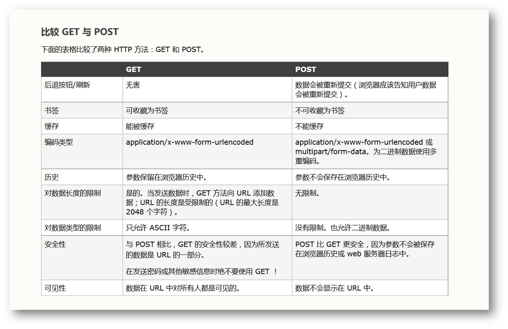
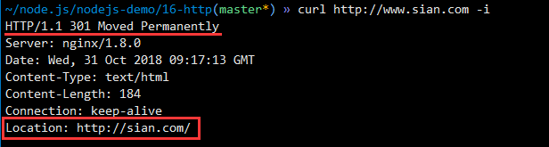
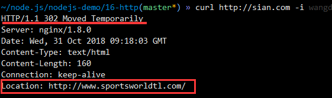
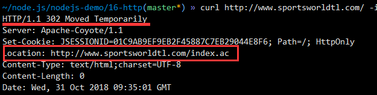
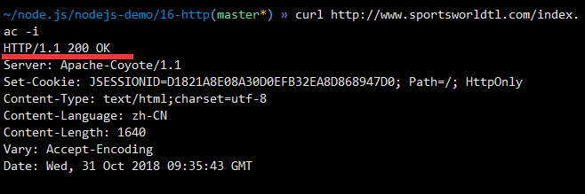

#### HTTP协议

##### 浏览器访问过程

+ 改文章参考相关链接：https://blog.csdn.net/m_buddy/article/details/77800998


总结起来大概的流程是这样的： 

+ 浏览器本身是一个客户端，当你输入URL的时候，首先浏览器会去请求DNS服务器，通过DNS获取相应的域名对应的IP 


+ 然后通过IP地址找到IP对应的服务器后，要求建立TCP连接 


+ 浏览器发送完HTTP Request（请求）包后，服务器接收到请求包之后才开始处理**请求包** 


+ 在服务器收到请求之后，服务器调用自身服务，返回HTTP Response**（响应）包** 


+ 客户端收到来自服务器的响应后开始渲染这个Response包里的主体（body），等收到全部的内容随后断开与该服务器之间的TCP连接。 

##### 域名解析的过程

在浏览器输入一串域名要访问某网站的时候，浏览器帮我们做了如下事情（以Chrome浏览器和windows系统为例）：

+ Chrome浏览器首先检查自己本地是缓存是否有对应的域名，有则直接使用。【查看Chrome浏览器dns缓存地址：[chrome://net-internals/#dns](undefined)】


+ 如果浏览器缓存中没有，则查询系统DNS缓存中的域名表，有则直接使用。【windows查看域名表的命令：ipconfig /displaydns】


+ 系统缓存中还是没有，则检查hosts文件中的映射表。【windows中hosts文件路径：C:\Windows\System32\drivers\etc】


+ 本地实在找不到，则向DNS域名服务器发起请求查询。【DNS服务器IP是本地配置的首选服务器，一般常用的有114.114.114.114（电信运营商提供）和8.8.8.8（Google提供）】
  + DNS服务器首先查找自身的缓存，有对应的域名ip则返回结果
  + 如果缓存中查找不到，DNS服务器则发起迭代DNS请求，首先向根域服务器发起请求查询，假如本次请求的是www.baidu.com,根域服务器发现这是一个com的顶级域名，就把com域的ip地址返回给DNS服务器
  + DNS服务器向com域ip地址发起请求，查询该域名的ip，此时该服务器返回了baidu.com的DNS地址。
  + 最后DNS服务器又向baidu.com的DNS地址发起查询请求，最后找到了完整的ip路径返回给DNS服务器，DNS再把ip信息返回给windows内核，内核再返回给浏览器，于是浏览器就知道该域名对应的ip地址了，可以开始进一步请求了。

##### HTTP请求

连接成功建立后，开始向web服务器发送请求，当浏览器向Web服务器发出请求时，它向服务器传递了一个数据块，也就是请求信息，HTTP请求信息由3部分组成： 

1. 起始行：HTTP请求方法 URL HTTP版本
2. 请求头：请求头的形式通过一个键值对进行渲染
3. 请求体：get方法的请求体是没有内容的（放在了url里） post方法的请求体包含请求的内容

下面是一个HTTP请求的例子：

```http
GET /sample.jsp HTTP/1.1
Accept:image/gif.image/jpeg,*/*
Accept-Language:zh-cn
Connection:Keep-Alive
Host:localhost
User-Agent:Mozila/4.0(compatible;MSIE5.01;Window NT5.0)
Accept-Encoding:gzip,deflate 
username=jinqiao&password=123412345678
```

**起始行**

+ 请求的起始行是：”`方法 URL http版本`“  `GET  /sample.jsp HTTP/1.1`


+ 根据HTTP标准，HTTP请求可以使用多种请求方法。例如：HTTP1.1支持7种请求方法：GET、POST、HEAD、OPTIONS、PUT、DELETE和TARCE。在Internet应用中，最常用的方法是GET和POST。 


+ URL完整地指定了要访问的网络资源，通常只要给出相对于服务器的根目录的相对目录即可，因此总是以“/”开头。
+ 协议版本声明了通信过程中使用HTTP的版本。

**请求头(Request Header)**

请求头包含许多有关的客户端环境和请求正文的有用信息。例如，请求头可以声明浏览器所用的语言，请求正文的长度等。

```http
Accept:image/gif.image/jpeg.*/*
Accept-Language:zh-cn
Connection:Keep-Alive
Host:localhost
User-Agent:Mozila/4.0(compatible:MSIE5.01:Windows NT5.0)
Accept-Encoding:gzip,deflate.123456
```

+ host表示主机名，User-Agent表示用户代理即浏览器

**请求正文**

请求头和请求正文之间是一个空行，这个行非常重要，它表示请求头已经结束，接下来的是请求正文。请求正文中可以包含客户提交的查询字符串信息：

```http
username=jinqiao&password=12341
```

在以上的例子的HTTP请求中，请求的正文只有一行内容。当然，在实际应用中，HTTP请求正文可以包含更多的内容。

##### HTTP响应

应答 web服务器收到这个请求，进行处理。从它的文档空间中搜索子目录mydir的文件index.html。如果找到该文件，Web服务器把该文件内容传送给相应的Web浏览器。为了告知浏览器，Web服务器首先传送一些HTTP头信息，然后传送具体内容（即HTTP体信息），HTTP头信息和HTTP体信息之间用一个空行分开。

HTTP应答与HTTP请求相似，HTTP响应也由3个部分构成，分别是： 

1. 起始行：HTTP协议版本 响应状态码 响应状态信息
2. 响应头(Response Header) ：通过键值对的形式进行表示
3. 响应体： 网页代码 HTML、CSS、JS代码文件

下面是一个HTTP响应的例子：

```http
HTTP/1.1 200 OK
Server:Apache Tomcat/5.0.12
Date:Mon,6Oct2003 13:23:42 GMT
Content-Length:112

<html>
    <head>
        <title>HTTP响应示例<title>
    </head>
    <body>
        Hello HTTP!
    </body>
</html>
```

协议状态代码描述HTTP响应的第一行类似于HTTP请求的第一行，它表示通信所用的协议是HTTP1.1服务器已经成功的处理了客户端发出的请求（200表示成功）: 
`HTTP/1.1 200 OK` 
响应头(Response Header)响应头也和请求头一样包含许多有用的信息，例如服务器类型、日期时间、内容类型和长度等：

```http
Server:Apache Tomcat/5.0.12
Date:Mon,6Oct2003 13:13:33 GMT
Content-Type:text/html
Last-Moified:Mon,6 Oct 2003 13:23:42 GMT
Content-Length:11212345
```

响应体就是服务器返回的HTML页面：

```http
<html>
    <head>
        <title>HTTP响应示例<title>
    </head>
    <body>
        Hello HTTP!
    </body>
</html>12345678
```

响应头和正文之间也必须用**空行**分隔。

**HTTP应答码**



HTTP应答码也称为状态码，它反映了Web服务器处理HTTP请求状态。**HTTP应答码由3位数字构成，其中首位数字定义了应答码的类型**： 

+ 1XX－信息类(Information),表示收到Web浏览器请求，正在进一步的处理中 


+ 2XX－成功类（Successful）,表示用户请求被正确接收，理解和处理例如：200 OK 


+ 3XX - 重定向类(Redirection),表示请求没有成功，客户必须采取进一步的动作。 


+ 4XX - 客户端错误(Client Error)，表示客户端提交的请求有错误 例如：404 NOT Found，意味着请求中所引用的文档不存在。 


+ 5XX - 服务器错误(Server Error)表示服务器不能完成对请求的处理：如 500 

##### 任务要求：了解 HTTP 协议

要求：

- HTTP 协议相关的知识主要包括：
  - HTTP 命令，包括：GET、POST等
  - HTTP 报文，包括：请求报文头，请求报文体、响应报文头和响应报文体
  - HTTP 响应状态码
- 阅读 [HTTP 协议资料](https://en.wikipedia.org/wiki/Hypertext_Transfer_Protocol#Message_format) 阅读 [HTTP 协议入门](http://www.ruanyifeng.com/blog/2016/08/http.html) 阅读 [HTTP 头部字段资料](https://en.wikipedia.org/wiki/List_of_HTTP_header_fields) 阅读 [HTTP 状态码资料](https://en.wikipedia.org/wiki/List_of_HTTP_header_fields)
- 用 telnet 工具了解 HTTP 协议的相关知识、用 curl 工具了解 HTTP 协议的相关知识、用 chrome 开发者工具了解 HTTP 协议的相关知识
- 用上面三个工具访问 [http://sample.wangding.in/web/one-div.html](http://sample.wangding.in/web/one-div.html) ，查看请求和响应的头信息
- 搞明白请求头部字段列表中每个字段的含义和作用
- 搞明白响应头部字段列表中每个字段的含义和作用

```bash
~ » curl http://sample.wangding.in/web/one-div.html              wangding@OFFICE
# 直接返回对应的html文件内容，由于是命令行工具，因此不能够进行渲染
<!DOCTYPE html>
<html>
  <head></head>
  <body></body>
</html>
------------------------------------------------------------
~ » curl http://sample.wangding.in/web/one-div.html -v           wangding@OFFICE
# 加上参数-v可以直接显示出来对应的所有内容
* About to connect() to sample.wangding.in port 80 (#0)
*   Trying 185.199.109.153... # dns解析出对应的域名
* Connected to sample.wangding.in (185.199.109.153) port 80 (#0) # 进行TCP连接
> GET /web/one-div.html HTTP/1.1
> User-Agent: curl/7.29.0
> Host: sample.wangding.in
> Accept: */*
> 
< HTTP/1.1 200 OK
< Server: GitHub.com
< Content-Type: text/html; charset=utf-8
< Last-Modified: Wed, 13 Jun 2018 08:24:27 GMT
< ETag: "5b20d4bb-146"
< Access-Control-Allow-Origin: *
< Expires: Tue, 30 Oct 2018 07:07:45 GMT
< Cache-Control: max-age=600
< X-GitHub-Request-Id: 2D16:563C:2485737:2FF1319:5BD800E9
< Content-Length: 326
< Accept-Ranges: bytes
< Date: Tue, 30 Oct 2018 07:00:27 GMT
< Via: 1.1 varnish
< Age: 162
< Connection: keep-alive
< X-Served-By: cache-hkg17921-HKG
< X-Cache: HIT
< X-Cache-Hits: 4
< X-Timer: S1540882828.772362,VS0,VE0
< Vary: Accept-Encoding
< X-Fastly-Request-ID: 84d0102672d42d756ed3d4ef8a8c8f7ccea8b776
< 
<!DOCTYPE html>
<html>
  <head>
    <meta charset="UTF-8">
    <title><>ne div game</title>
    <style type="text/css">
      #game {
        width: 100px;
        height: 100px;
        background-color: green;
        margin: 100px auto;
      }
    </style>
  </head>
  <body>
      <div id="game"></div>
  </body>
</html>
* Connection #0 to host sample.wangding.in left intact
```


#### GET和POST方法

+ get方法



+ post方法





##### 实现 HTTP 客户端

- 可以解释命令行参数，命令行参数是要请求的 URL 地址
- 向指定的 URL 地址发出 GET 请求
- 将 HTTP 响应的报文头和报文体内容打印到控制台
- 用 http 模块的 get 方法
- 定义 user-agent 为 01-my-curl

```javascript
#!/usr/bin/node

const http = require('http'),
      url = require('url');

var address = process.argv[2] || 'http://localhost:8080';

const options = {
  hostname:url.parse(address).hostname,
  prot:url.parse(address).prot,
  path:url.parse(address).pathname,
  headers:{
    'User-Agent':'01-my-curl',
  }
}
http.get(options,(res)=>{
  console.log('http/'+res.httpVersion,res.statusCode,res.statusMessage);
  console.log(res.headers);
  console.log();
  res.pipe(process.stdout);
});
```

```bash
# 程序运行结果
~/node.js/nodejs-demo/16-http(master*) » ./01-my-curl.js
http/1.1 200 OK
{ date: 'Tue, 30 Oct 2018 13:01:33 GMT',
  connection: 'close',
  'content-length': '11' }

hello world%

~/node.js/nodejs-demo/01-introduction(master*) » ./02-hello-world-server.js 
# 定义 user-agent 为 01-my-curl
{ 'user-agent': '01-my-curl',
  host: 'localhost:8080',
  connection: 'close' }
```

##### 对 HTTP 接口发出 GET 请求

- 调用天气预报 API，实现城市天气查询：[https://www.juhe.cn/docs/api/id/39](https://www.juhe.cn/docs/api/id/39)
- 用 GET 方法请求天气信息


- 获取某个账户的所有 GitHub 仓库的数量和名称

- API 地址：`https://api.github.com/search/repositories?q=user:wangding`

- API 参考：[https://developer.github.com/v3/](https://developer.github.com/v3/)


```javascript
/*get-weather*/
#!/usr/bin/node

const http = require('http');
var city = process.argv[2] || '石家庄';
var address = 'http://v.juhe.cn/weather/index?format=2&cityname='+ city + '&key=089c1db918016aa1643dcc167dc789fb';

http.get(global.encodeURI(address),(res)=>{
  var result = '';
  
  res.on('data',(data)=>{
  	result += data.toString('utf-8');
  });
  
  res.on('end',()=>{
  	console.log(JSON.parse(result));
  })
});
```

```javascript
/*get-repos*/
#!/usr/bin/node

const http = require('http');
var 
```


##### 发起 POST 请求

- 编写 03-post.js 脚本，向指定的 URL 地址发出 HTTP POST 请求
- 并且 POST 请求中，携带向服务器程序发送的特定数据
- 将 HTTP 响应的报文头和报文体内容打印到控制台
- 编写 03-server.js 脚本，接收 03-post.js 脚本发送的 POST 请求数据
- 将接收到的数据打开到控制台


```javascript
/*03-server.js*/
#!/usr/bin/node

const http = require('http');

http.createServer((req,res)=>{
  	console.log(req.headers);
  	req.pipe(process.stdout);
  	res.end('OK!');
}).listen(8080);
```

```javascript
/*03-post.js*/
#!/usr/bin/node

const http = require('http'),
      url = require('url');

var address = process.argv[2] || 'http://localhost:8080';

const options = {
  hostname:url.parse(address).hostname;
  prot:url.parse(address).prot,
  path:url.parse(address).pathname,
  method:'POST',
  headers:{
    'User-Agent':'03-server',
  }
};

const req = http.request(options,(res)=>{
  console.log('http/'+res.httpVersion,res.statusCode,res.statusMessage);
  console.log(res.headers);
  console.log();
  res.pipe(process.stdout);
});
req.write("{'name':'wangding'}'");
req.end();
```

程序运行结果

```bash
# 前台得到的消息
~/node.js/nodejs-demo/16-http(master*) » ./03-post.js            wangding@OFFICE
HTTP/1.1 200 OK
{ date: 'Tue, 30 Oct 2018 13:19:48 GMT',
  connection: 'close',
  'content-length': '3' }

OK!%

# 服务器得到的消息
~/node.js/nodejs-demo/16-http(master*) » ./03-server.js          wangding@OFFICE
{ 'user-agent': '03-server',
  host: 'localhost:8080',
  connection: 'close',
  'transfer-encoding': 'chunked' }
{""name":"wangding""}
```
#### 编写爬虫程序

- 创建 04-crawler 目录，创建项目配置文件：package.json
- `npm i -S cheerio` 安装项目依赖 cheerio
- 用 cheerio 对爬取的 HTML 页面进行 DOM 元素解析
- cheerio 用法请参考：[cheerio API](https://cnodejs.org/topic/5203a71844e76d216a727d2e)
- 爬取 51CTO 学院所有的免费课程信息
- 需爬取的网页地址：[http://edu.51cto.com/courselist/index-zh5.html](http://edu.51cto.com/courselist/index-zh5.html)
- 从爬取的网页中解析出课程信息，包括：课程名称，课程时长，课程地址，教学目标
- 将爬取的课程信息格式化输出到控制台
- 实现多任务并发爬取

```javascript
/*
1. npm init 创建项目配置文件
2. npm i -S cheerio 安装项目依赖cheerio (i的目的是为了自动加入到package.json上去)
*/

#!/usr/bin/node

const http = require('http'),
      cheerio = require('cheerio');

for(var i = 1;i<87;i++){
  var address = 'http://edu.51cto.com/courselist/index-zh5-p' + i + '.html';
  http.get(address,(res)=>{
  	var html = '';
    
    res.on('data',(data)=>{
  		html +=data;
	});
    
    res.on('end',()=>{
        // 沿用JQuery风格，定义$
  		var $ = cheerio.load(html);
    	$('body').find('div.main').each(function(){
  			var cName = $(this).find('a').text(),
                cTime = $(this).find('p.fl').text(),
                cTarget = $(this).find('div.course_target').text(),
                cUrl = $(this).find('a').attr('href');
          	if(cTime === '') return;
          	console.log('课程名称：',cName);
          	console.log('课程时长：',cTime);
          	console.log('课程目标：',cTarget);
          	console.log('课程地址：',cUrl);
		});
	});
  });
}

/*
运行结果
./index.js > out.html 重定向到了out.html里面
cat out | wc -l 统计out.html的行数
9856
*/
```

#### 处理 HTTP 重定向

- 实现对 HTTP 协议的重定向状态的处理
- 测试 URL：[http://www.sian.com/](http://www.sian.com/)
- 需要获取重定向后的最终页面
- 将最终页面输出到控制台

程序运行结果









```javascript
#!/usr/bin/node

const http = require('http'),
      url = require('url');

var address = 'http://www.sian.com/';

function getOption(addr){
  var options = url.parse(address);
  
  options.headers = {'User-Agent':'curl/7.0'};
  return options;
}

function getUrl(options){
  http.createServer((req,res)=>{
    console.log('HTTP/' + res.httpVersion,res.statusCode,res.statusMessage);
    console.log(res.headers);
    console.log();
    if(res.statusCode > 300 && res.statusCode <400){
  		var newAddr = res.headers['location'];
      	getUrl(getOption(newAddr));
	}else{
  		res.pipe(process.stdout);
	}
  });
}

getUrl(getOption(address));
```

程序运行结果

```bash
~/node.js/nodejs-demo/16-http(master*) » ./05-redirection.js     wangding@OFFIC
HTTP/1.1 301 Moved Permanently
{ server: 'nginx/1.8.0',
  date: 'Wed, 31 Oct 2018 09:52:41 GMT',
  'content-type': 'text/html',
  'content-length': '184',
  connection: 'close',
  location: 'http://sian.com/' }

HTTP/1.1 302 Moved Temporarily
{ server: 'nginx/1.8.0',
  date: 'Wed, 31 Oct 2018 09:52:42 GMT',
  'content-type': 'text/html',
  'content-length': '160',
  connection: 'close',
  location: 'http://www.sportsworldtl.com/' }

HTTP/1.1 302 Moved Temporarily
{ server: 'Apache-Coyote/1.1',
  'set-cookie': [ 'JSESSIONID=C3F4D55A3A87FE4E2CF2E881A0ECA371; Path=/; HttpOnly' ],
  location: 'http://www.sportsworldtl.com/index.ac',
  'content-type': 'text/html;charset=UTF-8',
  'content-length': '0',
  date: 'Wed, 31 Oct 2018 09:52:42 GMT',
  connection: 'close' }

HTTP/1.1 200 OK
{ server: 'Apache-Coyote/1.1',
  'set-cookie': [ 'JSESSIONID=077BD21F2C6A2B594F1EE36956398E2C; Path=/; HttpOnly' ],
  'content-type': 'text/html;charset=utf-8',
  'content-language': 'zh-CN',
  'content-length': '1640',
  vary: 'Accept-Encoding',
  date: 'Wed, 31 Oct 2018 09:52:42 GMT',
  connection: 'close' }

<!DOCTYPE html>
<!--[if IE 8]> <html lang="zh-CN" class="ie8 no-js"> <![endif]--><!--[if IE 9]> <html lang="zh-CN" class="ie9 no-js"> <![endif]--><!--[if !IE]><!--> <html lang="zh-CN" class="no-js"> <!--<![endif]-->
<!-- END BODY -->
</html>
```
