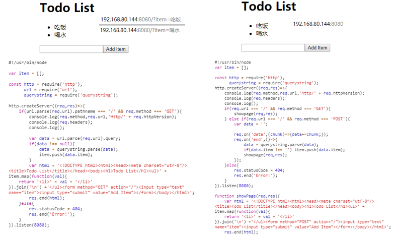
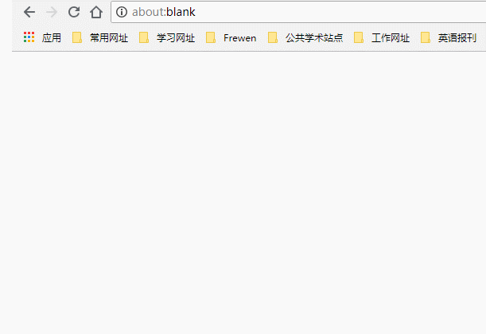
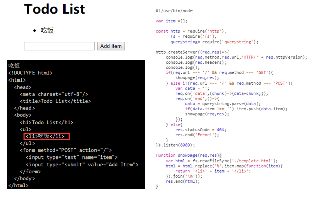

#### 处理 GET 请求的 FORM 表单

- 使用 http 模块创建 web 服务监听 8080 端口
- 当 HTTP 请求的 URL 不是网站根路径（/）时，提示客户端 404 错误
- 向客户端发送一个 TODO list 表单页面，页面上用户可以填写待办事项
- 用户点击提交按钮后，表单使用 HTTP 的 GET 方法提交到服务程序
- 服务程序接收表单数据，并将待办事项放到 TODO list 表单页面，发送给客户端
- 用 chrome 浏览器测试服务程序，用 curl 测试服务程序

```javascript
#!/usr/bin/node

var item = [];

const http = require('http'),
      url = require('url'),
      querystring = require('querystring');

http.createServer((req,res)=>{
  	if(url.parse(req.url).pathname === '/' && req.method === 'GET'){
      	console.log(req.method,req.url,'Http/' + req.httpVersion);
      	console.log(req.headers);
      	console.log();
      
      	var data = url.parse(req.url).query;
      	// var data = url.parse(req.url,true).query; if(data.item !== undefined){...}
      	if(data !== null){
  			data = querystring.parse(data);
          	item.push(data.item);
		}
  		var html = '<!DOCTYPE html><html><head><meta charset="utf-8"/><title>Todo List</title></head><body><h1>Todo List</h1><ul>' + item.map(function(val){
  	return '<li>' + val + '</li>'
}).join('\n') +'</ul><form method="GET" action="/"><input type="text" name="item"><input type="submit" value="Add Item"></form></body></html>';
      	// map()返回的是新数组：它不修改调用的数组 join() 方法用于把数组中的所有元素放入一个字符串
		res.end(html);
	}else{
  		res.statusCode = 404;
      	res.end('Error!');
	}
}).listen(8080);
```

#### 处理 POST 请求的 FORM 表单

- 使用 http 模块创建 web 服务监听 8080 端口
- 当 HTTP 请求的 URL 不是网站根路径（/）时，提示客户端 404 错误
- 当收到客户端 HTTP GET 请求时，发送给客户端 TODO list 表单页面
- 页面上用户可以填写待办事项，用户提交表单使用 POST 方法
- 用 chrome 浏览器测试服务程序，用 curl 测试服务程序，TODO list 表单页面样式见任务六

```javascript
#!/usr/bin/node

var item = [];

const http = require('http'),
      querystring = require('querystring');

http.createServer((req,res)=>{
  	console.log(req.method,req.url,'Http/' + req.httpVersion);
    console.log(req.headers);
    console.log();
  	if(req.url === '/' && req.method === 'GET'){
  		showpage(req,res);
	} else if(req.url === '/' && req.method === 'POST'){
  		var data = '';
      	
      	req.on('data',(chunk)=>{data+=chunk;});
      	req.on('end',()=>{
            data = querystring.parse(data);
      		if(data.item !== '') item.push(data.item);
  			showpage(req,res);
		});
	}else{
  		res.statusCode = 404;
      	res.end('Error!');
	}
}).listen(8080);

function showPage(req,res){
  	var html = '<!DOCTYPE html><html><head><meta charset="utf-8"/><title>Todo List</title></head><body><h1>Todo List</h1><ul>' + item.map(function(val){
  	return '<li>' + val + '</li>'
}).join('\n') +'</ul><form method="POST" action="/"><input type="text" name="item"><input type="submit" value="Add Item"></form></body></html>';
    // map()返回的是新数组：它不修改调用的数组 join() 方法用于把数组中的所有元素放入一个字符串
	res.end(html);
}
```



#### 网页 Linux 命令行

- 编写 05-form-cmd.js 脚本，基于 05-form-post.js 代码框架，用户在表单页面上提交 linux 命令
- 服务程序利用子进程技术执行 linux 命令
- 服务程序将 `linux` 命令的运行结果返回到网页上
- 命令运行结果要求能够正确的换行显示

```javascript
#!/usr/bin/node
var item = '';

const http = require('http'),
      querystring = require('querystring'),
      cp = require('child_process');

http.createServer((req,res)=>{
  console.log(req.method,req.url,'http/'+ req.httpVersion);
  console.log(req.headers);
  console.log();
  if(req.url === '/' && req.method === 'GET'){
    showpage(req,res);
  }else if(req.url === '/' && req.method === 'POST'){
    var data = '';
    
    req.on('data',(chunk)=>{data+=chunk;});
    req.on('end',()=>{
      item = '';
      data = querystring.parse(data);
      data = data.item.split(' ');
      console.log(data);
      var cmd = data[0],arg = [];
      console.log(cmd);
      for(var i = 1;i<data.length;i++){
        arg.push(data[i]);
      }
      cp.execFile(cmd,arg,(err,out,error)=>{
        if(err){
          console.error(err.message);
        }
        if(error){
          console.log(error);
        }
        console.log(out);
        item = out;
        showpage(req,res);
      });
    });
  }else{
    res.statusCode = 404;
    res.end('Error!');
  }
}).listen(8080);

function showpage(req,res){
  var html = '<!DOCTYPE html><html><head><meta charset="utf-8"/><title>Linux Command</title></head><body><h1>Input a Linux command</h1><form method="POST" action="/"><input type="text" name="item"><input type="submit" value="execute"></form><div>' + item  +'</div></body></html>';
  res.end(html);
}
```

#### 处理文件上传

- 能够接收任意格式文件上传
- 将上传的文件保存在脚本所在目录
- 保存在服务器上的文件名和上传的文件名相同
- 用 crul 命令测试脚本
- 编写文件上传的 HTML 页面
- 用浏览器访问上传文件的 HTML 页面，实现文件上传
- 改进程序，让程序能够同时支持多个文件上传

```javascript
#!/usr/bin/node

const http = require('http'),
      querystring = require('querystring'),
      fs = require('fs');

const uploadPage = '<!DOCTYPE html><html><head><meta charset="utf-8"/><title>Upload File</title></head><body><h1>Upload</h1><form method="POST" action="/" enctype="multipart/form-data"><input type="file" name="filename"><input type="submit" value="Upload"></form></body></html>';

const backPage = '<!DOCTYPE html><html><head><title>Back</title><meta charset="utf-8"/></head><body><h1>OK! Upload Sucess!</h1><a href="/">Continue to Upload File</a></body></html>';

const errorPage = '<!DOCTYPE html><html><head><title>Error</title><meta charset="utf-8"/></head><body><h1>Something Wrong!</h1><a href="/">Back to Upload</a></body></html>';

http.createServer((req,res)=>{
  	console.log(req.method,req.url,'HTTP/' + req.httpVersion);
  	console.log(req.headers);
  	console.log();
  	if(req.url === '/' && req.method === 'GET'){
  		showpage(req,res,uploadPage);
	} else if(req.url === '/' && req.method === 'POST'){
  		var data = '';
      	req.setEncoding('binary'); // 保证可以读取任何的文件,对应的是二进制编码
      	req.on('data',(chunk)=>{data+=chunk;});
      	req.on('end',()=>{
  			var das = data.split('\r\n');
      		// 找到文件内容和文件名称 进行创建
      		var fileData = das[4];
      		var fileName = querystring.parse(das[0].split('; ')[2]).filename;
      		fileName = fileName.slice(1,fileName.length-1);
      		fs.writeFileSync(fileName,fileData).toString('binary');// 二进制的形式进行
      		showpage(req,res,backPage);
		});
	} else{
  		showpage(req,res,errorPage);
	}
}).listen(8080);

function showpage(req,res,page){
  res.statusCode = (page === 'errorPage')?404:200;
  res.setHeader('content-type','text/html');
  res.setHeader('content-length',Buffer.byteLength(page));
  res.end(page);
}
```

程序运行结果：



#### 后台模板渲染

- 编写 07-form-html.js 脚本，对 03-form-post.js 重构
- 将 03-form-post.js 脚本中的 HTML 代码，保存在单独的文件中 template.html
- 将 template.html 中的待办事项数据部分用占位符 % 来代替
- 07-form-html.js 程序读取 template.html 模板文件
- 并将占位符 % 替换为具体的待办事项数据
- 用 chrome 测试服务程序

```javascript
#!/usr/bin/node

var item =[];

const http = require('http'),
      fs = require('fs'),
      querystring= require('querystring');

http.createServer((req,res)=>{
  	console.log(req.method,req.url,'HTTP/' + req.httpVersion);
  	console.log(req.headers);
  	console.log();
 	if(req.url === '/' && req.method === 'GET'){
  		showpage(req,res);
	} else if(req.url === '/' && req.method === 'POST'){
  		var data = '';
      	req.on('data',(chunk)=>{data+chunk;});
      	req.on('end',()=>{
  			data = querystring.parse(data);
      		if(data.item !== '') item.push(data.item);
      		showpage(req,res);
		});
	} else{
        res.statusCode = 404;
  		res.end('Error!');
	}
}).listen(8080);

function showpage(req,res){
  	var html = fs.readFileSync('./template.html');
  	html = html.replace('%',item.map(function(item){
  		return '<li>' + item + '</li>';
	}).join('\n'));
 	res.end(html);
}
```

```html
<!DOCTYPE html>
<html>
  <head>
    <meta charset="utf-8"/>
    <title>Todo List</title>
  </head>
  <body>
    <h1>Todo List</h1>
    <ul>
      %
    </ul>
    <form method="POST" action="/">
      <input type="text" name="item">
      <input type="submit" value="Add Item">
    </form>
  </body>
</html>
```

程序运行结果



#### 实现 RESTful API

- 阅读[理解 RESTful 架构](http://www.ruanyifeng.com/blog/2011/09/restful.html)
- 阅读 [RESTful API 设计指南](http://www.ruanyifeng.com/blog/2014/05/restful_api.html)
- 使用任务 1 方法解析的框架代码
- 实现对待办事项的增、删、改、查
- 用 curl 测试 RESTful API
- 阅读 [fetch 官方文档](https://fetch.spec.whatwg.org/)
- 阅读 [fetch 用法说明](http://blog.csdn.net/kajweb/article/details/72593482)
- 编写客户端代码使用 RESTful API
- 执行 `wget http://sample.wangding.in/nodejs/todo.html` 命令，获取网页 html 代码
- 在页面上实现查询和增加代办事项的功能，在页面上实现删除和修改代办事项的功能

