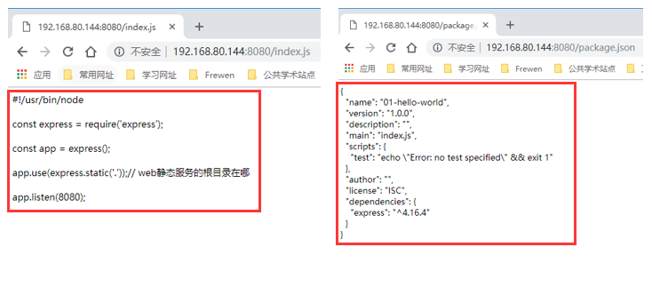
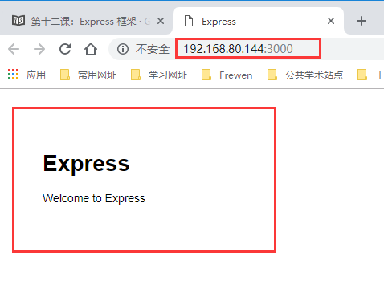
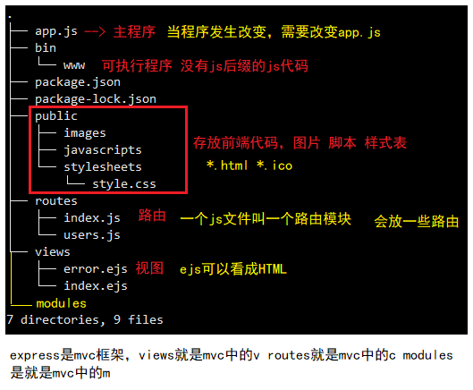
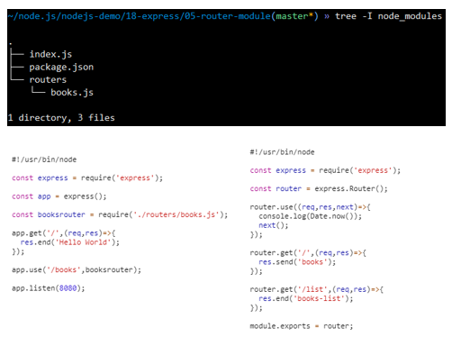

#### Express框架

Express 是一个简洁而灵活的 node.js Web应用框架, 提供了一系列强大特性帮助你创建各种 Web 应用，和丰富的 HTTP 工具。

使用 Express 可以快速地搭建一个完整功能的网站。

Express 框架核心特性：

- 可以设置中间件来响应 HTTP 请求。
- 定义了路由表用于执行不同的 HTTP 请求动作。
- 可以通过向模板传递参数来动态渲染 HTML 页面。

#### 编写 hello world web 程序

- `npm init` 初始化项目
- `npm i express -S` 安装 Express 模块
- 编写 index.js 脚本
- 实现一个 web 服务，监听 8080 端口
- 当浏览器请求网站根路径（/）时，返回客户端 hello world 响应
- 用 curl 或者 chrome 浏览器测试这个 web 服务

```javascript
#!/usr/bin/node

const express = require('express');

const app = express();

app.get('/',(req,res)=>{
  res.send('Hello World!'); // 其中res.send方法和res.end方法类似
});

app.listen(8080);
// GET method route
app.get('/', function (req, res) {
  res.send('GET request to the homepage')
});

// POST method route
app.post('/', function (req, res) {
  res.send('POST request to the homepage')
});
```

#### Web 静态文件服务

- npm 命令初始化项目，npm 命令安装 Express 模块
- 编写 index.js 脚本，web 服务器根路径是当面脚本所在目录
- web 服务监听 8080 端口，浏览器请求的 URL 合法时，返回给浏览器合适的文件资源
- 当 URL 地址中的资源文件不存在时，提示用户文件不存在的错误信息
- 用 curl 或者 chrome 浏览器测试这个 web 服务

Express 提供了内置的中间件`express.static` 来设置静态文件如：图片,CSS, JavaScript 等。

你可以使用`express.static` 中间件来设置静态文件路径。例如，如果你将图片, CSS, JavaScript 文件放在 public 目录下，你可以这么写：

```JavaScript
app.use(express.static('public'));
```

```javascript
#!/usr/bin/node

const express = require('express');

const app = express();

app.use(express.static('.'));

app.listen(8080);
```

测试结果：



#### Express 框架代码

##### 安装express代码升成器

- 切换到 linux 的 root 账户
- `npm i -g express-generator` 全局安装 express 代码生成器
- 切换到 linux 的开发者账户
- `express --version` 查看 express 代码生成器的版本，验证安装是否成功
- `express -h` 了解 express 代码生成器的命令行参数

```bash
~/node.js/nodejs-demo/18-express/02-static-web-server(master*) » su
密码：
[root@OFFICE 02-static-web-server]# npm i -g express-generator
/home/wangding/.nvm/versions/node/v10.12.0/bin/express -> /home/wangding/.nvm/versions/node/v10.12.0/lib/node_modules/express-generator/bin/express-cli.js
+ express-generator@4.16.0
updated 1 package in 2.597s
[root@OFFICE 02-static-web-server]# exit
exit
------------------------------------------------------------
~/node.js/nodejs-demo/18-express/02-static-web-server(master*) » express --version
4.16.0
------------------------------------------------------------
~/node.js/nodejs-demo/18-express/02-static-web-server(master*) » express -h

  Usage: express [options] [dir]


  Options:

        --version        output the version number
    -e, --ejs            add ejs engine support
        --pug            add pug engine support
        --hbs            add handlebars engine support
    -H, --hogan          add hogan.js engine support
    -v, --view <engine>  add view <engine> support (dust|ejs|hbs|hjs|jade|pug|twig|vash) (defaults to jade)
        --no-view        use static html instead of view engine
    -c, --css <engine>   add stylesheet <engine> support (less|stylus|compass|sass) (defaults to plain css)
        --git            add .gitignore
    -f, --force          force on non-empty directory
    -h, --help           output usage information
```

##### 创建网站框架

- `express -e 03-quick-start` 创建一个初始网站框架
- `cd 03-quick-start && npm install` 安装项目依赖
- `DEBUG=03-quick-start:* npm start` 启动网站
- 用 chrome 或 curl 测试这个网站，注意：这个网站默认监听 3000 端口

```bash
~/node.js/nodejs-demo/18-express(master*) » express -e 03-quick-start

  warning: option `--ejs' has been renamed to `--view=ejs'

   create : 03-quick-start/
   create : 03-quick-start/public/
   create : 03-quick-start/public/javascripts/
   create : 03-quick-start/public/images/
   create : 03-quick-start/public/stylesheets/
   create : 03-quick-start/public/stylesheets/style.css
   create : 03-quick-start/routes/
   create : 03-quick-start/routes/index.js
   create : 03-quick-start/routes/users.js
   create : 03-quick-start/views/
   create : 03-quick-start/views/error.ejs
   create : 03-quick-start/views/index.ejs
   create : 03-quick-start/app.js
   create : 03-quick-start/package.json
   create : 03-quick-start/bin/
   create : 03-quick-start/bin/www

   change directory:
     $ cd 03-quick-start

   install dependencies:
     $ npm install

   run the app:
     $ DEBUG=03-quick-start:* npm start

------------------------------------------------------------
~/node.js/nodejs-demo/18-express(master*) » cd 03-quick-start && npm install     wangding@OFFICE
npm notice created a lockfile as package-lock.json. You should commit this file.
added 53 packages from 38 contributors and audited 141 packages in 10.442s
found 0 vulnerabilities
------------------------------------------------------------
~/node.js/nodejs-demo/18-express/03-quick-start(master*) » DEBUG=03-quick-start:* npm start

> 03-quick-start@0.0.0 start /home/wangding/node.js/nodejs-demo/18-express/03-quick-start
> node ./bin/www

  03-quick-start:server Listening on port 3000 +0ms

```



##### 开发环境支持3000端口

```bash
# 查看自己开设了哪些端口
sudo firewall-cmd --zone=public --list-port

# 在防火墙上开设3000端口
sudo firewall-cmd --permanent --add-port=3000/tcp
sudo firewall-cmd --reload
```

##### 分析代码目录结构

- `tree -I node_modules` 查看项目目录结构



**app.js**

```javascript
var createError = require('http-errors');
var express = require('express');
var path = require('path');
var cookieParser = require('cookie-parser');
var logger = require('morgan');

# 获取对应的路由
var indexRouter = require('./routes/index');
var usersRouter = require('./routes/users');

var app = express();

# 设置对应的视图层 就是在render时所对应的view engine模板支持 以及所对应的views下的所有文件
// view engine setup
app.set('views', path.join(__dirname, 'views'));
app.set('view engine', 'ejs');

app.use(logger('dev'));
app.use(express.json());
app.use(express.urlencoded({ extended: false }));
app.use(cookieParser());
app.use(express.static(path.join(__dirname, 'public')));# 对应public下的所有文件配置了静态文件服务

app.use('/', indexRouter);
app.use('/users', usersRouter);

// catch 404 and forward to error handler
app.use(function(req, res, next) {
  next(createError(404)); # next表示的是本中间件处理需要跳转到下一个中间件进行处理
});

// error handler
app.use(function(err, req, res, next) {
  // set locals, only providing error in development
  res.locals.message = err.message;
  res.locals.error = req.app.get('env') === 'development' ? err : {};

  // render the error page
  res.status(err.status || 500);
  res.render('error');
});

module.exports = app;# export出app这个模块
```

**views/index.ejs**

```html
<!DOCTYPE html>
<html>
  <head>
    <title><%= title %></title>
    <link rel='stylesheet' href='/stylesheets/style.css' />
  </head>
  <body>
    <h1><%= title %></h1>
    <p>Welcome to <%= title %></p>
  </body>
</html>
```

**routes**

```javascript
// routes/index.js
var express = require('express');
var router = express.Router();

/* GET home page. */
router.get('/', function(req, res, next) {
  res.render('index', { title: 'Express' });
});

module.exports = router;
// routes/users.js
var express = require('express');
var router = express.Router();

/* GET users listing.
说明：为什么users下的目录也是根目录 是因为这个目录代表的是http://192.168.80.144:8080/users/ users后面的根目录
*/
router.get('/', function(req, res, next) {
  res.send('respond with a resource');
});

module.exports = router;
```

因此在项目过程中，如果改变了`public routes views`下的文件内容，需要到`app.js`下进行挂载

#### Express路由

Express的路由定义规则：`app.verb(path,[callback...],callback)`

对这个定义公式的每个参数说明一下：

1、verb表示方法，可以是get、post、put、delete等，常用的当然就是前面两个。

2、path表示路径，可以是一个字符串（String），也可以是一个正则表达式（Regex）。

3、callback表示路径处理函数，里面有个next方法，可以用next()，也可以用next('router')

详细内容可以看：https://blog.csdn.net/hansexploration/article/details/80503936

##### 基本路由

- npm 命令初始化项目，npm 命令安装 express 模块，编写 index.js 脚本
- 用 express 模块创建 web 服务，监听 8080 端口
- 脚本里处理三个路由：/、/json、/download，三个路由的 HTTP 方法都是 GET
- /json 路由，发送给客户端一个自定义对象
- /download 路由，发送给客户端 package.json 文件
- / 路由，绑定四个处理函数（中间件）
- 其中两个处理函数，单独用 function 关键字定义，另外两个处理函数，在 get 方法的参数中作为匿名函数出现
- 用 chrome 或 curl 测试服务程序

```javascript
#!/usr/bin/node

const express = require('express');

const app = express();

app.get('/json',(req,res)=>{
  res.json({name:'frewen',age:'12'});
  res.end(); // 可以加res.end 也可以不加
});

app.get('/download',(req,res)=>{
  res.download('packjson.json');// 不能加res.end
});
function c1(req,res,next){
  console.log('c1');
  next();// 如果不加next在控制台输出的时候会在c1保持不动
}

function c2(req,res,next){
  console.log('c2');
  next();
}

app.get('/',[c1,c2],(req,res,next)=>{
  console.log('c3');
  next();
},(req,res,next)=>{
  console.log('c4');
  res.send('OK!');
});

app.listen(8080);
```

##### 路由模块

在node启动文件里（app.js）配制了 路由配制文件的目录：

```javascript
....
app.use('/',require(path.join(__dirname,'/routes')));
....
```

然后 express会自动加载’/routes’目录下名为 index.js的文件


```javascript
// index.js
var express = require('express');
var router = express.Router();

router.use('/', require('./home'));
router.use('/Detail', require('./detail'));
router.use('/Home/List', require('./list'));
router.use('/Home/Article', require('./article'));

module.exports = router;
```

这样，当匹配到对应的一级/一二级 路由地址的时候，就会执行对应的文件中的逻辑代码，
在index.js引入其他的各个路由配制文件，比如 在detail.js写上:

```javascript
// detail.js
var express = require('express');
var router = express.Router();

router.get('/:date/:id.html', (req, res) => {
  res.render('Home/detail', {
    title: '详情页',
    date: req.params.date,
    id: req.params.id
  });
});

// 不含'.html'结尾的，重定向到包含'.html'结尾的url
router.get('/:date/:id', (req, res) => {
  res.redirect('/Detail'+req.path+'.html');
});

module.exports = router;
```

**任务要求：**

- npm 命令初始化项目，npm 命令安装 express 模块，编写 index.js 脚本
- HTTP GET 方法请求网站根的基本路由，给客户端返回 hello world
- 编写 books.js 路由模块脚本，放到 router 子目录下
- index.js 脚本 require 引入路由模块
- express 应用将 books.js 路由模块挂载到 /books 路径的 GET 方法下
- books 路由模块中，使用中间件（函数）打印调试信息 Date.now()
- books 路由模块中，处理 books/ 路由，返回客户端 books 字符串
- books 路由模块中，处理 books/list 路由，返回客户端 books-list 字符串
- 用 chrome 或 curl 测试服务程序

构建目录结构



```javascript
// index.js
#!/usr/bin/node

const express = require('express');

const app = express();

const booksrouter = require('./routers/books.js');
app.get('/',(req,res)=>{
  res.send('OK!');
});

app.use('/books',booksrouter);

app.listen(8080);
```

```javascript
// router/books.js

const express = require('express');

const router = express.Router();

router.use((req,res,next)=>{
  console.log(Date.now());
  next();
});
router.get('/',(req,res)=>{
  res.end('books!');
});

router.get('/list',(req,res)=>{
  res.end('books-list');
});
module.export = router;
```

#### Express 版 TODO List

- 用 express 代码生成器生成框架代码 06-todo-list
- 删除主程序 app.js 对 Cookie 机制的支持，删除主程序 app.js 对静态文件服务的支持，删除 public 目录，删除 users.js 路由文件，删除主程序 app.js 中对 users 路由模块的挂载和调用
- 修改 index.js 路由模块，支持 GET 和 POST 两个方法
- GET 方法渲染 TODO List 页面，并传递 items 数组给模板
- POST 方法将请求体中表单数据放入 items 数组中，并渲染页面
- 修改 index.ejs 模板页面，在页面中显示 H1 标题 TODO List
- H1 标题下方式表单区域，包括一个文本框，一个 submit 按钮
- 表单下方就是 TODO List 的 ul 列表
- 用 chrome 或 curl 测试服务程序

```javascript
// routers/index.js
#!/usr/bin/node

const express = require('express');

const router = express.Router();

var item = [];

router.get('/',(req,res,next)=>{
  res.render('index',{item:item});
});

router.post('/',(req,res,next)=>{
  if(req.body.item !== '') item.push(req.body.item);
  res.render('index',{item:item});
});

module.export = router;
```

```html
<!--index.ejs-->
<!DOCTYPE html>
<html>
  <head>
    <title>TODO list</title>
    <link rel='stylesheet' href='/stylesheets/style.css' />
  </head>
  <body>
    <h1>todolist</h1>
    <form method="POST" action="/">
      <input type="text" name="item">
      <input type="submit" value="Add Item">
    </form>
    <ul>
      <%- item.map(function(item){ return '<li>' + item +'</li>';}).join('\n') -%>
    </ul>
  </body>
</html>
```

#### Express 版 TODO List API

- 用 express 代码生成器生成框架代码 07-todo-list-api
- 删除主程序 app.js 对 Cookie 机制的支持，删除主程序 app.js 对静态文件服务的支持，删除 public 目录，删除主程序 app.js 中对视图模板的支持，删除 views 目录
- 修改主程序 app.js 中错误处理对视图模板的调用
- 删除 users.js 路由文件，删除主程序 app.js 中对 users 路由模块的挂载和调用
- 修改 index.js 路由模块，支持对 TODO List 的增、删、改、查
- 用 curl 测试服务程序

