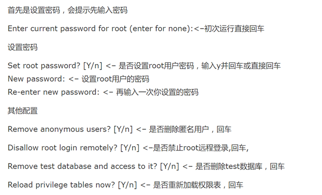

数据存储的方式一共有三种：内存存储、文件存储、数据库存储

#### Web 静态文件服务

- 编写 01-static-web-server.js 脚本，基于第五课：流，任务 3 的代码
- 实现内存缓存机制，提升 web 服务器的性能
- 如果请求的 url 中的文件不在内存缓存中
  - 读取磁盘上的文件，存入缓存
  - 将缓存中的文件内容发送给浏览器
- 如果请求的 url 中的文件在内存缓存中
  - 直接将缓存中的文件内容发送给浏览器

```javascript
#!/usr/bin/node

const http = require('http'),
      fs = require('fs');

var buffer = {};

http.createServer((req,res)=>{
  console.log(buffer);
  sendFile(res,req.url);
}).listen(8080);

function sendFile(res,url){
  	// 如果file在buf内存中不存在 会将文件加载到内存 如果存在直接读取buf内存的文件
  	if(!buf[file]){
  		if(!fs.existsSync(file)){
  			res.statusCode = 404;
          	res.end('File Not Found!');
		}
      	buffer[file] = fs.readFileSync(file);
	}
  	res.end(buffer[file]);
  	console.log(buffer);
}
```

程序运行结果：

```bash
~/node.js/nodejs-demo/19-data-storage(master*) » ./01-static-web-server.js
{}

{ '/home/wangding/node.js/nodejs-demo/19-data-storage/01-static-web-server.js': <Buffer 23 21 2f 75 73 72 2f 62 69 6e 2f 6e 6f 64 65 0a 0a 63 6f 6e 73 74 20 68 74 74 70 20 3d 20 72 65 71 75 69 72 65 28 27 68 74 74 70 27 29 2c 0a 20 20 20 ... > }

{ '/home/wangding/node.js/nodejs-demo/19-data-storage/01-static-web-server.js': <Buffer 23 21 2f 75 73 72 2f 62 69 6e 2f 6e 6f 64 65 0a 0a 63 6f 6e 73 74 20 68 74 74 70 20 3d 20 72 65 71 75 69 72 65 28 27 68 74 74 70 27 29 2c 0a 20 20 20 ... > }

{ '/home/wangding/node.js/nodejs-demo/19-data-storage/01-static-web-server.js': <Buffer 23 21 2f 75 73 72 2f 62 69 6e 2f 6e 6f 64 65 0a 0a 63 6f 6e 73 74 20 68 74 74 70 20 3d 20 72 65 71 75 69 72 65 28 27 68 74 74 70 27 29 2c 0a 20 20 20 ... > }
```

#### MySQL

##### 安装MySQL

+ 在 CentOS 7 Linux 上安装 MySQL运行安装命令

```bash
su # 切换到root用户
yum install -y mariadb mariadb-server # 安装MySQL服务器
systemctl start mariadb # 启动MySQL服务
```

```bash
~/node.js/nodejs-demo/19-data-storage(master*) » su              wangding@OFFICE
密码：
[root@OFFICE 19-data-storage]# yum install -y mariadb mariadb-server
已加载插件：fastestmirror
base                                                      | 3.6 kB  00:00:00     
extras                                                    | 3.4 kB  00:00:00     
nodesource                                                | 2.5 kB  00:00:00     
updates                                                   | 3.4 kB  00:00:00     
Loading mirror speeds from cached hostfile
 * base: mirrors.neusoft.edu.cn
 * extras: mirrors.njupt.edu.cn
 * updates: mirrors.njupt.edu.cn
软件包 1:mariadb-5.5.60-1.el7_5.x86_64 已安装并且是最新版本
软件包 1:mariadb-server-5.5.60-1.el7_5.x86_64 已安装并且是最新版本
无须任何处理
[root@OFFICE 19-data-storage]# systemctl start mariadb
[root@OFFICE 19-data-storage]# systemctl status mariadb
● mariadb.service - MariaDB database server
   Loaded: loaded (/usr/lib/systemd/system/mariadb.service; disabled; vendor preset: disabled)
   Active: active (running) since 三 2018-11-14 20:35:12 CST; 5s ago
  Process: 3162 ExecStartPost=/usr/libexec/mariadb-wait-ready $MAINPID (code=exited, status=0/SUCCESS)
  Process: 3131 ExecStartPre=/usr/libexec/mariadb-prepare-db-dir %n (code=exited, status=0/SUCCESS)
 Main PID: 3161 (mysqld_safe)
   CGroup: /system.slice/mariadb.service
           ├─3161 /bin/sh /usr/bin/mysqld_safe --basedir=/usr
           └─3336 /usr/libexec/mysqld --basedir=/usr --datadir=/var/lib/mysql ...

11月 14 20:35:04 OFFICE systemd[1]: Starting MariaDB database server...
11月 14 20:35:04 OFFICE mariadb-prepare-db-dir[3131]: Database MariaDB is pro...
11月 14 20:35:04 OFFICE mysqld_safe[3161]: 181114 20:35:04 mysqld_safe Loggi....
11月 14 20:35:05 OFFICE mysqld_safe[3161]: 181114 20:35:05 mysqld_safe Start...l
11月 14 20:35:12 OFFICE systemd[1]: Started MariaDB database server.
Hint: Some lines were ellipsized, use -l to show in full.
```

##### 配置 MySQL

+ 运行配置命令

```bash
mysql_secure_installation
```



+ 配置MySQL支持中文

```bash
# 打开my.cnf配置文件进行编辑
sudo vi /etc/my.cnf
# 修改对应的代码文件
[mysqld]
character-set-server=utf8
[client]
default-character-set=utf8
[mysql]
default-character-set=utf8

# 重新启动服务
sudo systemctl restart mariadb
```

##### 命令行操作 MySQL

- Linux 命令行连接 MySQL，运行命令：`mysql -u root -p`

- 在 test 数据库中，创建 books 表

  ```sql
  +---------+---------+------+-----+---------+-------+
  | Field   | Type    | Null | Key | Default | Extra |
  +---------+---------+------+-----+---------+-------+
  | book_id | int(11) | YES  |     | NULL    |       |
  | title   | text    | YES  |     | NULL    |       |
  | status  | int(11) | YES  |     | NULL    |       |
  +---------+---------+------+-----+---------+-------+
  ```

- 在 books 表上练习 CURD 操作

```sql
~ » mysql -u root -p                                             wangding@OFFICE
Enter password: 
Welcome to the MariaDB monitor.  Commands end with ; or \g.
Your MariaDB connection id is 2
Server version: 5.5.60-MariaDB MariaDB Server

Copyright (c) 2000, 2018, Oracle, MariaDB Corporation Ab and others.

Type 'help;' or '\h' for help. Type '\c' to clear the current input statement.

MariaDB [(none)]> use test
Database changed
MariaDB [test]> show tables;
Empty set (0.00 sec)

MariaDB [test]> create table books (book_id INT, title TEXT, status INT);
Query OK, 0 rows affected (0.00 sec)

MariaDB [test]> show tables;
+----------------+
| Tables_in_test |
+----------------+
| books          |
+----------------+
1 row in set (0.00 sec)

MariaDB [test]> describe books;
+---------+---------+------+-----+---------+-------+
| Field   | Type    | Null | Key | Default | Extra |
+---------+---------+------+-----+---------+-------+
| book_id | int(11) | YES  |     | NULL    |       |
| title   | text    | YES  |     | NULL    |       |
| status  | int(11) | YES  |     | NULL    |       |
+---------+---------+------+-----+---------+-------+
3 rows in set (0.00 sec)

MariaDB [test]> insert into books value(1,'node.js深入浅出',0);
Query OK, 1 row affected (0.00 sec)

MariaDB [test]> select * from books;
+---------+---------------------+--------+
| book_id | title               | status |
+---------+---------------------+--------+
|       1 | node.js深入浅出     |      0 |
+---------+---------------------+--------+
1 row in set (0.00 sec)

MariaDB [test]> update books set status = 1 where book_id = 1;
Query OK, 1 row affected (0.00 sec)
Rows matched: 1  Changed: 1  Warnings: 0

MariaDB [test]> select * from books;
+---------+---------------------+--------+
| book_id | title               | status |
+---------+---------------------+--------+
|       1 | node.js深入浅出     |      1 |
+---------+---------------------+--------+
1 row in set (0.00 sec)

MariaDB [test]> insert into books value(2,'JavaScript异步编程',1);
Query OK, 1 row affected (0.00 sec)

MariaDB [test]> select * from books;
+---------+------------------------+--------+
| book_id | title                  | status |
+---------+------------------------+--------+
|       1 | node.js深入浅出        |      1 |
|       2 | JavaScript异步编程     |      1 |
+---------+------------------------+--------+
2 rows in set (0.00 sec)

MariaDB [test]> delete from books where book_id = 2;
Query OK, 1 row affected (0.00 sec)

MariaDB [test]> select * from books;
+---------+---------------------+--------+
| book_id | title               | status |
+---------+---------------------+--------+
|       1 | node.js深入浅出     |      1 |
+---------+---------------------+--------+
1 row in set (0.00 sec)
```

##### 用 Node.js 对 MySQL 做 CURD 操作

- 安装 mysql 第三方库，连接到 test 数据库，做以下操作：
- 在 books 表中插入一条记录，查询 books 表中的记录
- 在 books 表中更改刚才插入的记录，查询 books 表中的记录
- 在 books 表中删除刚才修改的记录，查询 books 表中的记录
- 关闭连接

```javascript
#!/usr/bin/node

const mysql = require('mysql');

const con = mysql.createServer({
  host:'localhost',
  user:'root',
  password:'ddd',
  database:'test'
});
con.conent();

// database operation
// 查 const sql = 'select * from books';
// 增 const sql = 'insert into books where book_id = ?';
// 改 const sql = 'update books set status = ? where book_id = ?';
// 删 const sql = 'delete from books where book_id = ?';
con.query(sql,[1],(err,result)=>{
  	if(err){
  		console.error(err);
      	process.exit(1000);
	}
  	console.log(result);
});

con.end();
```

#### 基于 MySQL 存储的 Todo List

- 复制 18-express/06-todo-list 代码到 19-data-storage 目录，将 06-todo-list 目录改名为 04-todo-list，进入 04-todo-list 目录
- npm 安装 mysql 模块，创建 models 和 test 两个子目录
- models 目录下，编写 config.json 文件，配置 mysql 数据库连接参数，models 目录下，编写 database.js 脚本，创建 mysql 数据库连接池，models 目录下，编写 todo-list.js 脚本，定义 TodoList 类
- TodoList 类的 getAll 方法获取 todo 表中的所有记录，TodoList 类的 addItem 方法向 todo 表中添加一条待办事项
- 命令行连接 mysql 数据库，创建 todo_list 数据库以及 todo 表
- test 目录下，编写 todo-list-test.js 脚本，测试 models/todo-list.js 脚本
- 改写 router/index.js 路由模块，使用数据库操作模块 models/todo-list.js 来操作待办事项数据
- 用 chrome 或 curl 测试服务程序

目录结构：


```json
# modules/config.json

{
  "host":"localhost",
  "user":"root",
  "password":"ddd",
  "database":"todo_list",
  "connectionLimit":10,
  "supportBigNumbers":true
}
```

```javascript
# modules/database.js
const config = require('config.json');
const mysql = require('mysql');

const pool = mysql.createPool(config);

module.export = pool;
```

```javascript
# modules/todo-list.js

const db = require('database.js');

var TodoList = function(){};

TodoList.prototype.getAll = function(cb){
  	var item = [];
  	const sql = 'select * from todo_list';
  	db.query(sql,(err,result)=>{
  		if(err){
  			cb(true);
          	return;
		}
      	result.forEach((e)=>{item.push(e.item);});
      	cb(false,item);
	});
}

TodoList.prototype.addItem = function(item,cb){
  	const sql = 'insert into todo_list(item) value(?)';
  	db.query(sql,[item],(err,result)=>{
  		if(err){
  			cb(true);
          	return;
		}
      	cb(false,result);
	});
}

module.export = TodoList;
```

```javascript
# router/index.js

const TodoList = require('../modules/todo-list.js');
var express = require('express');
var router = express.Router();

var todo = new  TodoList();

router.get('/', function(req, res) {
  todo.getAll((err,item)=>{
    if(err){
      console.error(err);
      process.exit(1000);
    }
    res.render('index',{item:item});
  });
});


router.post('/',function(req,res){
  if(req.body.item !== ''){
    todo.addItem(req.body.item,(err)=>{
      if(err) console.error(err);
    });
  }
  todo.getAll((err,item)=>{
    if(err){
      console.error(err);
      process.exit(1000);
    }
    res.render('index',{item:item});
  });
});
module.exports = router;
```

运行结果：


