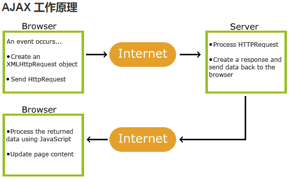
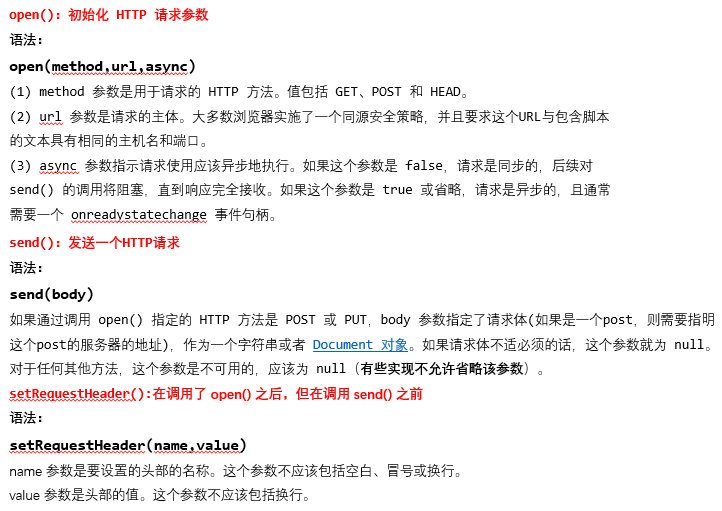

> 这篇文章主要用来复习一下ajax技术，通过ajax技术进而更好的能够理解web前端和后端之间的工作流程，进而能够实现相应的web前端开发

网站数据处理主要分为三层。

- 第一层，表示层，这部分可以用HTML代码，CSS/Javascript代码来实现等。通过前端代码可以实现网页的布局和设计。这层又可以称为显示层。也就是你用浏览器打开能看到的网页。
- 第二层，是业务层，这层是负责处理数据的。常用的代码语言有PHP,JSP，Java等。通过这些后台处理语言的算法来处理前台传回的数据。必要的时候进行操作数据库，然后把结果返回给前端网页。
- 第三层，是数据层，这个就是数据库，用来存储数据的。通过业务层的操作可以实现增删改数据库的操作。

① 你接触到的是这个网页是属于表示层，这个网页一般由HTML标签结合CSS/JAVASCRIPT来实现的。 这时候你要先填入数据。

② 然后你按提交触发后台处理机制，这时候数据会传到后台的代码进行处理。这部分代码根据不同网站可以使PHP、JSP、JAVA等。 代码根据程序员预设的算法将收到的数据进行处理之后会相应的对数据库进行操作，存储数据等。

③ 成功操作完数据库之后，业务层的代码会再向表示层也就是显示器端传回一个指令通知你表格填写成功

前端和后端是如何交互的，详情可以看文章：https://www.jianshu.com/p/6ad8f3d0927b

#### AJAX 简介

AJAX = 异步 JavaScript 和 XML。AJAX 是一种用于创建快速动态网页的技术。

通过在后台与服务器进行少量数据交换，AJAX 可以**使网页实现异步更新**。这意味着可以在不重新加载整个网页的情况下，对网页的某部分进行更新。



AJAX是基于现有的Internet标准，并且联合使用它们：

- XMLHttpRequest 对象 (异步的与服务器交换数据)
- JavaScript/DOM (信息显示/交互)
- CSS (给数据定义样式)
- XML (作为转换数据的格式)

  AJAX应用程序与浏览器和平台无关的！

#### AJAX 实例

```javascript
function loadXMLDoc(){
	var xmlhttp;
	if (window.XMLHttpRequest){
		//  IE7+, Firefox, Chrome, Opera, Safari 浏览器执行代码
		xmlhttp=new XMLHttpRequest();
	} else {
		// IE6, IE5 浏览器执行代码
		xmlhttp=new ActiveXObject("Microsoft.XMLHTTP");
	}
	xmlhttp.onreadystatechange=function(){
		if (xmlhttp.readyState==4 && xmlhttp.status==200){
			document.getElementById("myDiv").innerHTML=xmlhttp.responseText;
		}
	}
	xmlhttp.open("GET","/try/ajax/ajax_info.txt",true);
	xmlhttp.send();
}
```

#### AJAX创建对象

XMLHttpRequest 是 AJAX 的基础。

所有现代浏览器均支持 XMLHttpRequest 对象（IE5 和 IE6 使用 ActiveXObject）。

XMLHttpRequest 用于在后台与服务器交换数据。这意味着可以在不重新加载整个网页的情况下，对网页的某部分进行更新。

```javascript
var xmlhttp;
if (window.XMLHttpRequest){
  //  IE7+, Firefox, Chrome, Opera, Safari 浏览器执行代码
  xmlhttp=new XMLHttpRequest();
}else{
  // IE6, IE5 浏览器执行代码
  xmlhttp=new ActiveXObject("Microsoft.XMLHTTP");
}
```

#### AJAX请求

XMLHttpRequest 对象用于和服务器交换数据。

##### 向服务器发送请求

如需将请求发送到服务器，我们使用 XMLHttpRequest 对象的 open() 和 send() 方法：

+ xmlhttp.open("GET","ajax_info.txt",true);


+ xmlhttp.open("GET","ajax_info.txt",true);


| 方法                         | 描述                                       |
| -------------------------- | ---------------------------------------- |
| open(method*,*url*,*async) | 规定请求的类型、URL 以及是否异步处理请求                                                  method：请求的类型；GET 或 POST                                                                 url：文件在服务器上的位置                                                                              async：true（异步）或 false（同步） |
| send(string)               | 将请求发送到服务器。string：仅用于 POST 请求             |



##### GET 还是 POST？

与 POST 相比，GET 更简单也更快，并且在大部分情况下都能用。

然而，在以下情况中，请使用 POST 请求：

- 无法使用缓存文件（更新服务器上的文件或数据库）
- 向服务器发送大量数据（POST 没有数据量限制）
- 发送包含未知字符的用户输入时，POST 比 GET 更稳定也更可靠

**GET 请求**

```javascript
// 一个简单的 GET 请求：
xmlhttp.open("GET","/try/ajax/demo_get.php",true);
xmlhttp.send();

// 在上面的例子中，您可能得到的是缓存的结果。
// 为了避免这种情况，请向 URL 添加一个唯一的 ID：
xmlhttp.open("GET","/try/ajax/demo_get.php?t=" + Math.random(),true);
xmlhttp.send();

// 如果您希望通过 GET 方法发送信息，请向 URL 添加信息：
xmlhttp.open("GET","/try/ajax/demo_get2.php?fname=Henry&lname=Ford",true);
xmlhttp.send()
```

**POST 请求**

一个简单 POST 请求：

```javascript
// 会报错 服务器会给报错
xmlhttp.open("POST","/try/ajax/demo_post.php",true);
xmlhttp.send();

//如果需要像 HTML 表单那样 POST 数据，请使用 setRequestHeader() 来添加 HTTP 头。然后在 send()方法中规定您希望发送的数据：

xmlhttp.open("POST","/try/ajax/demo_post2.php",true);
xmlhttp.setRequestHeader("Content-type","application/x-www-form-urlencoded");
xmlhttp.send("fname=Henry&lname=Ford");
// setRequestHeader(header,value):向请求添加 HTTP 头。header: 规定头的名称value: 规定头的值
```

##### url - 服务器上的文件

open() 方法的 `url`参数是服务器上文件的地址：`xmlhttp.open("GET","ajax_test.html",true);`

该文件可以是任何类型的文件，比如 .txt 和 .xml，或者服务器脚本文件，比如 .asp 和 .php （在传回响应之前，能够在服务器上执行任务）。

##### 异步True 或 False？

AJAX 指的是异步 JavaScript 和 XML（Asynchronous JavaScript and XML）。

XMLHttpRequest 对象如果要用于 AJAX 的话，其 open() 方法的 async 参数必须设置为 true：

xmlhttp.open("GET","ajax_test.html",true);

对于 web 开发人员来说，发送异步请求是一个巨大的进步。很多在服务器执行的任务都相当费时。AJAX 出现之前，这可能会引起应用程序挂起或停止。

通过 AJAX，JavaScript 无需等待服务器的响应，而是：

- 在等待服务器响应时执行其他脚本
- 当响应就绪后对响应进行处理

#### AJAX响应

如需获得来自服务器的响应，请使用 XMLHttpRequest 对象的 responseText 或 responseXML 属性。

| 属性           | 描述              |
| ------------ | --------------- |
| responseText | 获得字符串形式的响应数据。   |
| responseXML  | 获得 XML 形式的响应数据。 |

- `responseText`：获取字符串形式的响应数据。目前为止为服务器接收到的响应体（不包括头部），或者如果还没有接收到数据的话，就是空字符串。
- `responseXML`：获取XML形式的响应数据。对请求的响应，解析为XML 并作为 [Document ](http://www.w3school.com.cn/xmldom/dom_document.asp)[对象](http://www.w3school.com.cn/xmldom/dom_document.asp)返回。
- `status和statusText`：以数字和文本形式返回HTTP状态码
- `getAllResponseHeader()`：获取所有的响应报头。把HTTP 响应头部作为未解析的字符串返回。
- `getResponseHeader()`：查询响应中的某个字段的值。返回指定的HTTP 响应头部的值。其参数是要返回的 HTTP 响应头部的名称。

##### onreadystatechange 事件

当请求被发送到服务器时，我们需要执行一些基于响应的任务。

每当 readyState 改变时，就会触发 `onreadystatechange` 事件。

`readyState` 属性存有 XMLHttpRequest 的状态信息。

下面是 XMLHttpRequest 对象的三个重要的属性：

| 属性                 | 描述                                       |
| ------------------ | ---------------------------------------- |
| onreadystatechange | 存储函数（或函数名），每当 readyState 属性改变时，就会调用该函数。  |
| readyState         | 存有 XMLHttpRequest 的状态。从 0 到 4 发生变化。0: 请求未初始化1: 服务器连接已建立2: 请求已接收3: 请求处理中4: 请求已完成，且响应已就绪 |
| status             | 200: "OK"404: 未找到页面                      |

在 onreadystatechange 事件中，我们规定当服务器响应已做好被处理的准备时所执行的任务。

**readyState**

HTTP请求的状态.当一个XMLHttpRequest 初次创建时，这个属性的值从0 开始，直到接收到完整的 HTTP 响应，这个值增加到4。

| 状态   | 名称            | 描述                                       |
| ---- | ------------- | ---------------------------------------- |
| 0    | Uninitialized | 初始化状态。XMLHttpRequest 对象已创建或已被  abort()  方法重置。 |
| 1    | Open          | open() 方法已调用，但是 send() 方法未调用。请求还没有被发送。   |
| 2    | Sent          | Send() 方法已调用，HTTP 请求已发送到  Web  服务器。未接收到响应。 |
| 3    | Receiving     | 所有响应头部都已经接收到。响应体开始接收但未完成。                |
| 4    | Loaded        | HTTP 响应已经完全接收。                           |

#### Ajax - json对象

```html
<!DOCTYPE html>
<html lang="en">
<head>
    <meta charset="UTF-8">
    <title>get json</title>
    <script type="text/javascript">
        window.onload = function() { /*设置在页面加载完后执行以下js代码*/
            var url = "sales.json"/*将连接赋到变量url中*/
            var request = new XMLHttpRequest();/*用new创建一个XHR对象*/
            request.open("GET",url);/*设置XHR对象的请求方法与路径*/
            request.send(null);/*设置XHR对象不发送数据到服务器*/
            request.onload = function() {/*设置当获XHR对象获取到返回信息后执行以下代码*/
                if(request.status == 200) {/*如果返回的状态为200，即为成功获取数据*/
                    var contentdiv = document.getElementById("content");
                  	/*获取DOM中id为luck的p元素*/
                    var jsoncontent = JSON.parse(request.responseText);
                  	/*将获取的信息解析为json对象*/
                    var jsondiv = document.createElement("div");
                  	/*在js中创建一个div元素命名为jsondiv*/
                    jsondiv.innerHTML = jsoncontent[0].name;
                  	/*将json对象中第一个元素的name属性对应的值写入jsondiv中*/
                    contentdiv.appendChild(jsondiv);
                  	/*将jsondiv放入DOM中，作为contentdiv的子元素*/
                }
            }

        }
    </script>
</head>
<body>
    <p>获取的json内容如下</p>
    <div id="content"></div>
</body>
</html>
```