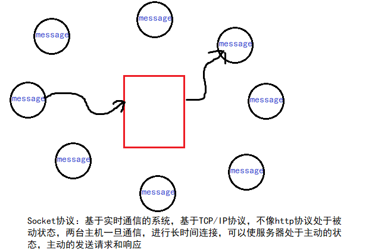
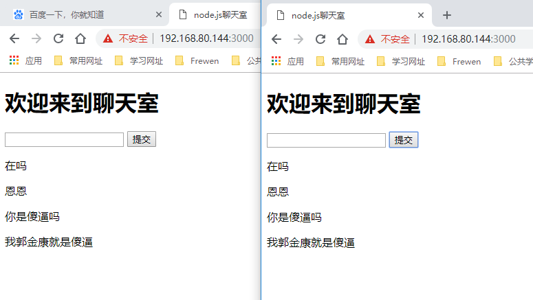

## Node.js聊天室

前断时间在学习nodejs，自己闲来无事，在网上搜索了一些资料自己搭建了一个属于自己的web聊天室项目。现在把自己的开发过程和心得和大家分享，希望其中涉及到的一些知识对你有用。

### 项目目录结构

```bash
~/chat » tree -I node_modules                                    wangding@OFFICE
.
├── client.html
└── server.js

0 directories, 2 files
```

### socket.io

> 关于socket.io的使用请参考网址：https://www.w3cschool.cn/socket/



#### 安装

```bash
$ npm install socket.io
```

#### 使用 Node http 服务器

##### 服务端 (app.js)

```JavaScript
var app = require('http').createServer(handler)
var io = require('socket.io')(app);
var fs = require('fs');

app.listen(80);

function handler (req, res) {
  fs.readFile(__dirname + '/index.html',
  function (err, data) {
    if (err) {
      res.writeHead(500);
      return res.end('Error loading index.html');
    }

    res.writeHead(200);
    res.end(data);
  });
}

io.on('connection', function (socket) {
  socket.emit('news', { hello: 'world' });
  socket.on('my other event', function (data) {
    console.log(data);
  });
});     
```

##### 客户端 (index.html)

```html
<script src="/socket.io/socket.io.js"></script>
<script>
  var socket = io('http://localhost');
  socket.on('news', function (data) {
    console.log(data);
    socket.emit('my other event', { my: 'data'});
  });
</script>
```

#### 使用 Express

##### 服务端 (app.js)

```JavaScript
var app = require('express')();
var server = require('http').Server(app);
var io = require('socket.io')(server);

server.listen(80);

app.get('/', function (req, res) {
  res.sendfile(__dirname + '/index.html');
});

io.on('connection', function (socket) {
  socket.emit('news', { hello: 'world' });
  socket.on('my other event', function (data) {
    console.log(data);
  });
});
```

##### 客户端 (index.html)

```html
<script src="/socket.io/socket.io.js"></script>
<script>
  var socket = io.connect('http://localhost');
  socket.on('news', function (data) {
    console.log(data);
    socket.emit('my other event', { my: 'data' });
  });
</script>
```

### 聊天应用

#### 客户端代码

```html
<!DOCTYPE html>
<html>
<head>
  <title>node.js聊天室</title>
  <meta charset="utf-8"/>
</head>
<body>
  <h1>欢迎来到聊天室</h1>
  <textarea id="text"></textarea>
  <input id="btn" type="submit" value="提交"/>
</body>
  <script src="https://cdnjs.cloudflare.com/ajax/libs/socket.io/2.1.1/socket.io.js"></script>
  <script>
    var socket = io.connect('/');
    // console.log(socket);
    
    document.getElementById("btn").onclick = function () {
      var val = document.querySelector("#text").value;
      //console.log(val);
      if (!val) return;

      document.querySelector("#text").value = "";
      socket.send(val);
    };
    
    socket.on("message", function (msg) {
      var p = document.createElement("p");
      p.innerText = msg;
      document.body.appendChild(p);                               
    });
  </script>
</html>
```

#### 服务端代码

```javascript
#!/usr/bin/node

const http = require('http'),
      fs = require('fs'),
      ws = require('socket.io');

var server = http.createServer((req,res)=>{
  var data = fs.readFileSync('./client.html');
  res.end(data);
});


const io = ws(server); // 基于当前的web服务开启socket实例
//console.log(io);
// 检测连接事件
io.on('connection',function(socket){
  // 接受客户端所发送的信息
  //console.log('connect sucess'); 
  socket.on('message',(mes)=>{
    // 向所有客户端广播发送的消息
    
    //console.log(mes);
    io.emit('message',mes);
  });
});

server.listen(3000);
```

#### 效果运行结果



