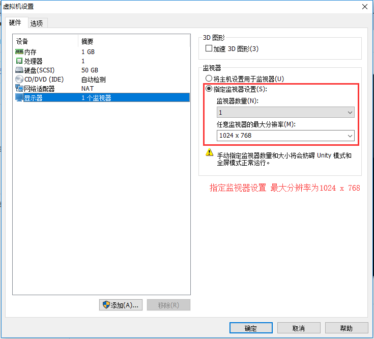

### 搭建开发环境

下载并安装 `vmware workstation Pro 12+`（软件密匙`5A02H-AU243-TZJ49-GTC7K-3C61N`）

下载并导入 [mocha.ova](http://pan.baidu.com/s/1o8a3E3o) 开发环境



配置mocha虚拟机网卡的ip地址信息

- 查看mocha虚拟机的ip地址`(ifconfig)`
- 配置虚拟的的ip地址和`vmnet8`的ip网段相同`(192.168.80.144)`

```markdown
root@office# vim/etc/sysconfig/network-scripts/ifcfg-ens32
ipaddr = 192.168.80.144
gateway= 192.168.80.2
```

- 重启网络进行配置

```markdown
systemctl restart network
```

下载并安装 xshell 5(在xshell5中进行连接，连接的登录名为wangding，密码为ddd 连接的快捷键alt + o)

